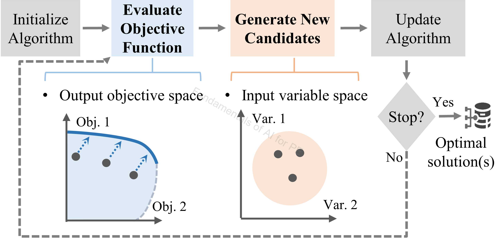
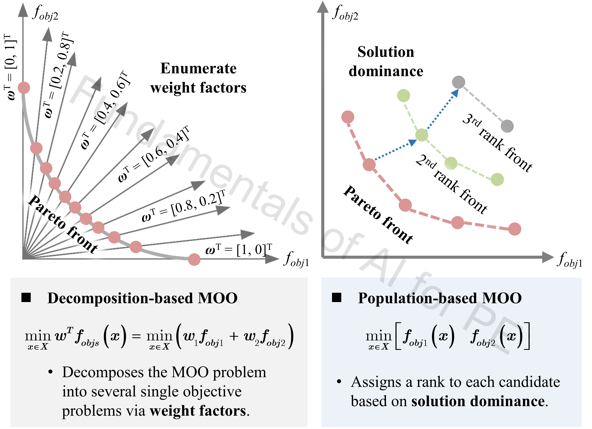

# 1_MHA (Meta-Heuristic Algorithms)

## Authorship & status

- **Course / code author:** Xinze Li  
- **Review article:** Xinze Li, Fanfan Lin, Juan J. Rodríguez-Andina, Sergio Vazquez, Homer Alan Mantooth, Leopoldo García Franquelo, “Fundamentals of Artificial Intelligence for Power Electronics,” *IEEE Transactions on Industrial Electronics*, 2026.

*These learning resources are still under active refinement; notebooks, data, and documentation may change.*

---

## Google Colab

  
  &nbsp;&nbsp;
  

  
  &nbsp;&nbsp;
  
  &nbsp;&nbsp;
  

---

## Alignment with the review article

**Discussion in the article:** [`Single_Objective_MHA/`](Single_Objective_MHA/) — **Section V-A** (generic MHA workflow), **V-C** (hyperparameter tuning). [`Multi_Objective_MHA/`](Multi_Objective_MHA/) — **Section V-B** (multi-objective MHAs), **V-C** (tuning).

The notebooks here support the metaheuristic optimization narrative in the invited review *Fundamentals of Artificial Intelligence for Power Electronics* (*IEEE Trans. Ind. Electron.*, 2026).

---

## Review article excerpt

> 

>   
> 

>
> 
<em>Figure 1. Generic workflow of MHAs.</em>

>
> Figure 1 introduces the generic workflow of **meta-heuristic algorithms (MHAs)** for optimization problems in power electronics. An MHA starts by initializing a group of candidate solutions, evaluates each candidate using a user-defined objective function, and then generates new candidates based on the search rule of the selected algorithm. Through repeated evaluation, candidate generation, and algorithm update, the search gradually moves toward better solutions until the stopping condition is reached.
>
> In power electronics, this workflow supports **converter design optimization**, **controller parameter tuning**, **maximum power point tracking**, and **circuit parameter identification**—especially when the problem is nonlinear, multi-objective, or difficult to solve with analytical methods. The notebooks in this folder implement that loop on benchmarks and PE-style design surfaces.
>
> 

>   
> 

>
> 
<em>Figure 2. Decomposition-based and population-based multi-objective MHAs.</em>

>
> Figure 2 introduces two common ways to handle **multi-objective optimization (MOO)** in meta-heuristic algorithms:
>
> - **Decomposition-based MOO** — multiple objectives are combined into one scalar objective using predefined weights. This approach is simple and intuitive, but it needs careful weight selection and objective normalization, and can suffer from the curse of dimensionality in objective space.  
> - **Population-based MOO** — a population of candidates is evaluated and ranked by dominance. Instead of a single optimum, the search approximates a **Pareto front**, which is especially useful in PE design when trading off efficiency, power density, reliability, and cost. See [`Multi_Objective_MHA/`](Multi_Objective_MHA/) for hands-on examples.
>
> **MHA tuning:** balance **global exploration** and **local exploitation**. A practical strategy is broad exploration in early iterations (cover diverse regions of the design space), then gradually emphasize local refinement around promising solutions—as explored in **Section V-C** notebooks such as `pso_hyp_tuning.ipynb`.

---

Single- and multi-objective metaheuristics from benchmark functions to power-electronics-style design problems.

## Contents

- `Single_Objective_MHA/sing_obj_MHA.ipynb`  
- `Single_Objective_MHA/pso_hyp_tuning.ipynb`  
- `Single_Objective_MHA/algorithm_stats_compare.ipynb`  
- `Single_Objective_MHA/buck_design_PSO.ipynb`  
- `Multi_Objective_MHA/multi_obj_MHA_master.ipynb`  

## Outcomes

- PSO and NSGA-II in engineering optimization loops  
- Objective functions, constraints, penalties  
- PSO hyperparameters and variants (e.g. LDIW, TVAC)  
- Statistical comparison across repeated optimizer runs  
- Pareto fronts and design choice on trade-off surfaces  
- MHA applied to PE examples (buck, DAB-related settings)  

---

### `sing_obj_MHA.ipynb`

**Topics:** Single-objective PSO on Sphere and Rastrigin; linearly decreasing inertia; particle trajectories; comparison with LP / SLSQP / BFGS / Nelder-Mead and Differential Evolution.

**Algorithms & data:** PSO, DE, SLSQP, BFGS, Nelder-Mead, LP. Synthetic benchmarks only.

**Notes:** Custom PSO loop with dynamic inertia; animations for search paths and cost history; link between deterministic and stochastic optimization.

---

### `pso_hyp_tuning.ipynb`

**Topics:** PSO-LDIW vs. TVAC-PSO; inertia `w` sweeps with repeats; convergence iteration and best cost vs. settings.

**Algorithms & data:** PSO-LDIW, TVAC-PSO. Synthetic 10-D Rastrigin and 50-D One-Max–style setup.

**Notes:** Time-varying `w`, `c1`, `c2`; variance visible across runs; template for configuration studies.

---

### `algorithm_stats_compare.ipynb`

**Topics:** Repeated PSO and GA on 10-D Rastrigin; paired t-test; histograms and normal fits on best costs.

**Algorithms & data:** PSO (`pyswarms`), GA (`pygad`), paired t-test. Synthetic objective values.

**Notes:** Distribution-level comparison; significance testing; context for `pygad` runtime warnings.

---

### `buck_design_PSO.ipynb`

**Topics:** Synchronous buck as single-objective problem; analytical loss/volume-style objectives with penalties; PSO on `L`, `C` under constraints; landscape plots.

**Algorithms & data:** Penalty-based constrained PSO. Model outputs from analytical formulas — no external dataset.

**Notes:** Explicit feasibility penalties; 2D/3D surfaces for intuition; bridge from benchmarks to PE constraints.

---

### `multi_obj_MHA_master.ipynb`

**Topics:** Pareto dominance and non-dominated sorting (toy + ZDT-1); NSGA-II with `pymoo`; Pareto evolution and PE-style multi-objective selection.

**Algorithms & data:** Non-dominated sorting, NSGA-II, `paretoset` / `pymoo`. Synthetic and formula-based objectives.

**Notes:** Pareto front over iterations; design retrieval from Pareto sets by value ranges; transition from academic MOO to design decisions.

---

## Algorithm summary

- **Single-objective:** PSO (several variants), GA  
- **Multi-objective:** NSGA-II, non-dominated sorting, Pareto analysis  
- **Baselines:** Differential Evolution, SLSQP, BFGS, Nelder-Mead, LP  

## Recommended learning sequence

1. `sing_obj_MHA.ipynb`  
2. `pso_hyp_tuning.ipynb`  
3. `algorithm_stats_compare.ipynb`  
4. `buck_design_PSO.ipynb`  
5. `multi_obj_MHA_master.ipynb`  
