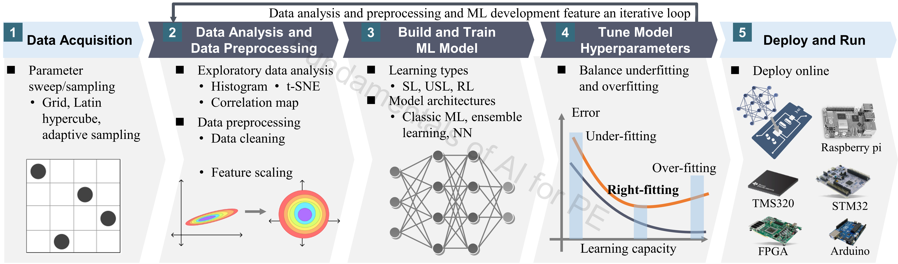
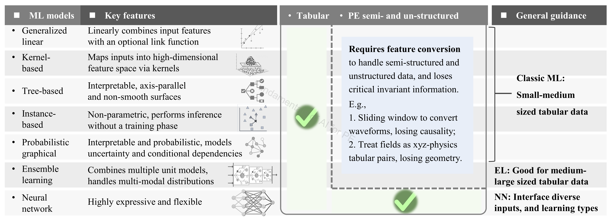

# 2_Classic_ML

## Authorship & status

- **Course / code author:** Xinze Li  
- **Review article:** Xinze Li, Fanfan Lin, Juan J. Rodríguez-Andina, Sergio Vazquez, Homer Alan Mantooth, Leopoldo García Franquelo, “Fundamentals of Artificial Intelligence for Power Electronics,” *IEEE Transactions on Industrial Electronics*, 2026.

*These learning resources are still under active refinement; notebooks, data, and documentation may change.*

---

## Google Colab

  
  &nbsp;&nbsp;
  
  &nbsp;&nbsp;
  

---

## Alignment with the review article

**Discussion in the article:** [`ridge_polynomial_regression.ipynb`](ridge_polynomial_regression.ipynb) — **Section III-C–III-E** (features + regularized regression). [`classic_ML.ipynb`](classic_ML.ipynb) — **Section III-B**, **III-E** (EDA, decision trees). [`gaussian_process_bayesian_optimization.ipynb`](gaussian_process_bayesian_optimization.ipynb) — **Section III-E** (GP regression), **V-C** (Bayesian hyperparameter optimization).

The classical ML baseline here supports the review narrative in *Fundamentals of Artificial Intelligence for Power Electronics* (*IEEE Trans. Ind. Electron.*, 2026).

---

## Review article excerpt

> 

>   
> 

>
> 
<em>Figure 1. Machine learning workflows for data-driven power electronics projects in a nutshell.</em>

>
> Figure 1 introduces a generic workflow for **data-driven machine learning projects** in power electronics. A typical project begins with **data acquisition** (simulation or experimental data via parameter sampling), followed by **Exploratory Data Analysis(EDA)**, cleaning, and **feature scaling** before model training. After training, **hyperparameters are tuned** to balance underfitting and overfitting, and the model can be **deployed** on the target platform.
>
> In practice, EDA, preprocessing, training, and tuning often form an **iterative loop**: prediction errors or abnormal results can reveal data issues and motivate further refinement of acquisition, preprocessing, or model choice—themes covered in **Sec. III-B–III-E** and in notebooks such as [`classic_ML.ipynb`](classic_ML.ipynb) and [`ridge_polynomial_regression.ipynb`](ridge_polynomial_regression.ipynb).
>
> 

>   
> 

>
> 
<em>Figure 2. Machine learning models.</em>

>
> Figure 2 summarizes common **machine learning model families** and their fit to different PE data formats:
>
> - **Classic ML** (generalized linear, kernel-based, tree-based, instance-based, probabilistic graphical models) — strong for **small- to medium-sized tabular** data with physically meaningful features (this folder).  
> - **Ensemble learning** — combines weak learners for better generalization; strong baselines for **medium- to large tabular** PE data (see [`3_Ensemble_Learning/`](../3_Ensemble_Learning/)).  
> - **Neural networks** — flexible input representations, backbones, and heads for diverse formats and tasks when tabular conversion loses structure (waveform causality, field geometry, etc.; see [`4_Neural_Network/`](../4_Neural_Network/)).
>
> Hyperparameter search for surrogate models also connects to **Sec. V-C**, as in [`gaussian_process_bayesian_optimization.ipynb`](gaussian_process_bayesian_optimization.ipynb).

---

Classical machine learning: **regression** notebooks (polynomial Ridge on synthetic data; GP regression + Bayesian hyperparameter optimization on California housing) and a **classification** notebook (decision trees on Breast Cancer).

## Contents

- `ridge_polynomial_regression.ipynb` — bias–variance story in 1-D  
- `gaussian_process_bayesian_optimization.ipynb` — GP regression on `fetch_california_housing`; expected-improvement BO for kernel/noise hyperparameters; diagnostic plots  
- `classic_ML.ipynb` — classification and decision boundaries  

## Outcomes

- **Polynomial Ridge regression** on synthetic 1-D data: **underfitting**, **overfitting**, and regularization (`ridge_polynomial_regression.ipynb`)  
- **Gaussian process regression** with predictive uncertainty; **Bayesian optimization** (EI) to tune GP hyperparameters on a validation split (`gaussian_process_bayesian_optimization.ipynb`)  
- `scikit-learn` classification pipeline from data to metrics  
- Decision tree training on a standard benchmark  
- Accuracy and confusion matrix  
- Decision boundaries in 2D projected feature space  
- Fuzzy decision tree branch

---

## Notebook outline

- **`ridge_polynomial_regression.ipynb`** — 1-D bias–variance with polynomial Ridge.  
- **`gaussian_process_bayesian_optimization.ipynb`** — GP regression on California housing + expected-improvement BO for kernel/noise hyperparameters.  
- **`classic_ML.ipynb`** — Breast Cancer classification; decision boundaries (optional fuzzy tree branch).  

## Algorithms & data

- **Algorithms:** `DecisionTreeClassifier`; optional `FuzzyDecisionTreeClassifier`; in the GP notebook — `GaussianProcessRegressor` (constant × RBF), custom EI loop.  
- **Data:** Breast Cancer Wisconsin (built-in); California housing (built-in, GP notebook). No repo CSV/MAT required for these two modules.

## Notes

- Depth matched between classic and fuzzy tree where possible for a fair comparison.  
- Heatmaps and 2D boundaries support both numeric and geometric interpretation.

## Recommended learning sequence

1. `ridge_polynomial_regression.ipynb` for the regression / regularization narrative.  
2. `gaussian_process_bayesian_optimization.ipynb` for surrogate modeling and BO (optional second regression track).  
3. `classic_ML.ipynb` with default `scikit-learn` only (decision tree).  
4. Review confusion matrix and boundaries for the classic tree.  
5. Optionally install `fuzzytree` and compare.  
6. Try other feature pairs or `max_depth` to see boundary changes.
