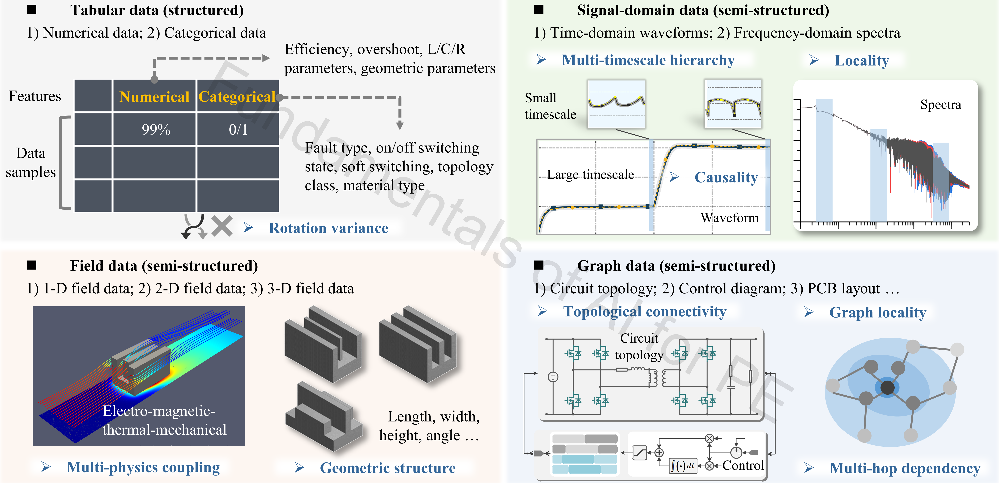
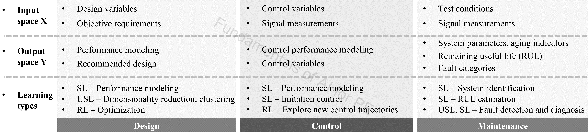
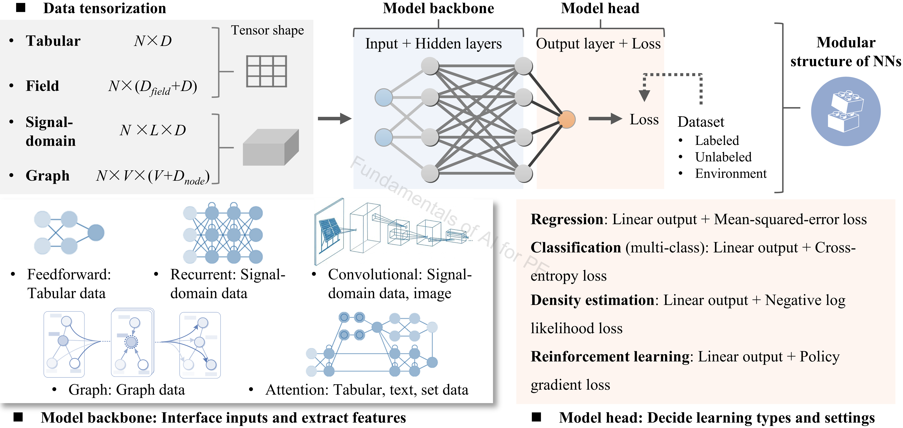

# 4_Neural_Network

## Authorship & status

- **Course / code author:** Xinze Li  
- **Review article:** Xinze Li, Fanfan Lin, Juan J. Rodríguez-Andina, Sergio Vazquez, Homer Alan Mantooth, Leopoldo García Franquelo, “Fundamentals of Artificial Intelligence for Power Electronics,” *IEEE Transactions on Industrial Electronics*, 2026.

*These learning resources are still under active refinement; notebooks, data, and documentation may change.*

---

## Google Colab

  
  &nbsp;&nbsp;
  

  
  &nbsp;&nbsp;
  

  

---

## Alignment with the review article

Subfolders map to **Section II** (PE data modalities) and **Section III** (NN topics) of *Fundamentals of Artificial Intelligence for Power Electronics* (*IEEE Trans. Ind. Electron.*, 2026) as follows:

| Subfolder | Article sections |
|-----------|------------------|
| [`Fundamentals/`](Fundamentals/) | **III-F** (fundamentals of NNs) |
| [`Good_Practices/`](Good_Practices/) | **III-G** (good practices of NNs) |
| [`Field_Data/`](Field_Data/) | **II-C** (field data); **III-F**, **III-G** |
| [`Signal_Domain/`](Signal_Domain/) | **II-B** (signal-domain data); **III-F** (sequence models) |
| [`Multi_Modal_Distribution/`](Multi_Modal_Distribution/) | **III-F** (MDN / probabilistic NN outputs) |
| [`Graph_NN/`](Graph_NN/) | **II-D**, **III-E** (see [`Graph_NN/README.md`](Graph_NN/README.md)) |

---

## Review article excerpt

> 

>   
> 

>
> 
<em>Figure 1. Power electronics data formats and their key feature invariants. Unstructured data are omitted because they are not specific to PE.</em>

>
> Figure 1 introduces the major **power-electronics data formats**. PE data are not limited to standard structured, tabular features; they also include semi-structured **signal-domain** data, **field** data, and **graph** data, each with its own feature invariants.
>
> - **Tabular data** — numerical and categorical features (e.g. efficiency, topology class), where each column has a fixed physical meaning ([`Fundamentals/`](Fundamentals/), [`Good_Practices/`](Good_Practices/)).  
> - **Signal-domain data** — waveforms and spectra with temporal or spectral locality, causality, and multi-timescale hierarchy ([`Signal_Domain/`](Signal_Domain/)).  
> - **Field data** — multi-physics distributions with geometric structure ([`Field_Data/`](Field_Data/)).  
> - **Graph data** — circuit topologies, control diagrams, and PCB layouts through connectivity, graph locality, and multi-hop dependency ([`Graph_NN/`](Graph_NN/)).
>
> Recognizing these formats is essential for selecting neural-network architectures that preserve underlying PE-specific information.
>
> 

>   
> 

>
> 
<em>Figure 2. Applications of ML algorithms throughout the lifecycle phases of power converters.</em>

>
> Figure 2 summarizes how different **learning types** support AI applications across the PE lifecycle:
>
> - **Design** — supervised learning maps design variables to performance metrics; inverse modeling recommends feasible parameters from targets; unsupervised learning supports clustering or dimensionality reduction; reinforcement learning can assist topology synthesis or design-space exploration.  
> - **Control** — supervised learning models control performance or imitates existing controllers; reinforcement learning explores new control trajectories via interaction with a converter model or simulator (see [`7_Reinforcement_Learning/`](../7_Reinforcement_Learning/)).  
> - **Maintenance** — supervised learning for system identification, RUL estimation, and fault classification; unsupervised or semi-supervised learning for fault detection when labeled failures are scarce (see [`9_Case_Studies_PE/`](../9_Case_Studies_PE/)).
>
> 

>   
> 

>
> 
<em>Figure 3. Modular structure of neural networks, consisting of a model backbone and a model head.</em>

>
> Figure 3 illustrates the **modular structure of neural networks (NNs)** for power electronics applications. A generic NN consists of a **model backbone** and a **model head**. The backbone starts with **data tensorization**, where different PE data formats are converted into suitable tensor representations—tabular features, signal-domain sequences, field tensors, or graph-structured inputs. Hidden layers then extract task-relevant features using architectures matched to the data format: feedforward layers for tabular data; recurrent or convolutional layers for signal-domain data; convolutional layers for field or image-like data; graph layers for topology-structured data. The **model head** (output layer and loss function) determines the learning type—regression, classification, density estimation, or reinforcement learning. In this way, NNs provide a flexible framework that interfaces with diverse PE data formats while supporting different learning tasks through backbone and head design (see [`Fundamentals/NN_basics.ipynb`](Fundamentals/NN_basics.ipynb), [`Multi_Modal_Distribution/`](Multi_Modal_Distribution/) for MDN outputs).
>
> **NN tuning:** the central goal is to find the right balance between **underfitting** and **overfitting**. A practical strategy is to first intentionally **overfit** the training set with a sufficiently large model, ensuring enough capacity to capture the latent input–output mapping, then gradually **simplify and regularize** based on validation performance. **Architecture tuning** typically starts with capacity-related parameters (number of hidden layers and neurons), followed by layer types, activation functions, normalization layers, and residual connections. **Optimizer-related hyperparameters**—training epochs, learning rate, and regularization strength—should then be tuned to improve convergence and generalization. **Early stopping** is particularly useful when validation loss stops improving and the model begins to overfit. In practice, more complex architectures (layer stacking, hybrid blocks) should be adopted only when they provide measurable gains, verified through **ablation studies**—workflow emphasized in [`Good_Practices/good_practice_NN.ipynb`](Good_Practices/good_practice_NN.ipynb) and [`Field_Data/field_temperature_residual_fnn.ipynb`](Field_Data/field_temperature_residual_fnn.ipynb).

---

Neural networks from tabular regression/classification through **spatial (3D) field** regression, sequence models, and mixture-density (MDN) regression, including a **hysteresis** extension (Part 3b in the MDN notebook): rate-independent loops, **Prandtl–Ishlinskii** play-operator superposition vs an **MDN** that targets multimodal **p(y|x)**, with references to **B–H**-style behavior in magnetic components.

## Contents

- `Fundamentals/NN_basics.ipynb`  
- `Good_Practices/good_practice_NN.ipynb`  
- `Field_Data/field_temperature_residual_fnn.ipynb`  
- `Signal_Domain/rnn_basics.ipynb`  
- `Multi_Modal_Distribution/mixture_density_net_ensemble_learning.ipynb`  
- [`Graph_NN/README.md`](Graph_NN/README.md) — graph neural networks: external course (GML2023), Awesome GNN list, PE application (C2G)  

## Outcomes

- Feedforward networks for regression and classification  
- Train/val/test splits, normalization, minibatches, and **best-weight** selection (saved to disk where noted, or **in memory only** in `Field_Data/`)  
- **3D thermal fields:** residual (skip-connection) FNN from tabular samples; **per-CSV** train/val/test splits; diagnostics (incl. 3-D residual plots and hotspot reporting)  
- Sequence models for waveforms / time series (RNN, LSTM, GRU, BiLSTM, related variants)  
- Probabilistic regression via MDN and uncertainty in the outputs  
- Model combination on multimodal targets and comparison to ensemble baselines  
- Hysteresis as motivation: single-valued maps fail on loops; PI-style state (play operators) vs mixture models for **p(y|x)** on the same synthetic loop  
- *(Graph track)* Where to learn **GNNs** and how they apply to **converter graphs** — see [`Graph_NN/README.md`](Graph_NN/README.md)

---

### `Fundamentals/NN_basics.ipynb`

**Topics:** FNN on California Housing (regression) and Breast Cancer (classification); heads and losses; softmax + NLL-style classification; optional density / probabilistic section.

**Algorithms & data:** FNN/MLP regression and classification. `fetch_california_housing`, `load_breast_cancer`.

**Notes:** Feature scaling; train/val loss; residuals, confusion, ROC; dropout in the classifier.

---

### `Good_Practices/good_practice_NN.ipynb`

**Topics:** Capacity sanity checks; `BatchNorm1d`; strict train/val/test; `DataLoader` minibatches; best checkpoint by validation loss; `ReduceLROnPlateau`; gradient z-scoring before the optimizer step.

**Algorithms & data:** Feedforward regression with stronger training discipline. Tabular data prepared inside the notebook.

**Notes:** Full-batch vs. minibatch comparison; saved best weights; scaler fit on train only.

---

### `Field_Data/field_temperature_residual_fnn.ipynb`

**Topics:** 3-D thermal field regression — residual FNN on downsampled `Tfield_*` CSVs (`x,y,z,loss,Tamb` → `T`); file-wise train/val/test splits; 3-D residual diagnostics.

**Algorithms & data:** Residual FNN (PyTorch). **`Field_Data/cap_Tfield/*.csv`** (loss and ambient in filename).

**Notes:** Run with cwd **`4_Neural_Network/Field_Data`** (Colab setup cell `cd`s there).

---

### `Signal_Domain/rnn_basics.ipynb`

**Topics:** DAB waveform CSV loading and preprocessing; windowed FFN, RNN, LSTM, GRU, BiLSTM; further sequence directions in the notebook text; splits, model size, prediction plots.

**Algorithms & data:** Windowed FFN, RNN, LSTM, GRU, BiLSTM (+ transformer-oriented material as documented). Local PE waveform CSVs.

**Notes:** `AdamW` and weight decay; warmup + cosine-style schedules; best checkpoint before test evaluation.

---

### `Multi_Modal_Distribution/mixture_density_net_ensemble_learning.ipynb`

**Topics:** FNN → MDN for predictive uncertainty; optional hysteresis loop (play-operator NN vs MDN on \\(p(y|x)\\)).

**Algorithms & data:** FNN, MDN, `RandomForestRegressor`; synthetic regression + hysteresis loop.

**Notes:** Read MDN definitions before Part 3b (hysteresis / B–H motivation).

---

## Algorithm summary

- FNN / MLP (regression and classification)  
- Residual (skip-block) FNN for **3D field** regression (`Field_Data/`)  
- RNN family: vanilla RNN, LSTM, GRU, BiLSTM  
- Mixture Density Network (MDN)  
- `RandomForestRegressor` as a reference in the MDN notebook  
- Prandtl–Ishlinskii-style hysteresis (play operators + superposition NN) in the MDN notebook  

## Data summary

- Tabular: California Housing, Breast Cancer  
- **Thermal field samples:** `Field_Data` CSVs (`x,y,z,T`; power loss and ambient encoded in the filename)  
- PE waveforms: DAB CSV time series  
- Synthetic nonlinear regression (`make_moons`-style pipeline)  
- Synthetic hysteresis loop (time-ordered input, multimodal **p(y|x)** vs PI state)  

## Recommended learning sequence

1. `Fundamentals/NN_basics.ipynb`  
2. `Good_Practices/good_practice_NN.ipynb`  
3. `Field_Data/field_temperature_residual_fnn.ipynb` *(spatial regression + file-wise splits; best after good practices)*  
4. `Signal_Domain/rnn_basics.ipynb`  
5. `Multi_Modal_Distribution/mixture_density_net_ensemble_learning.ipynb`  
6. *(Optional graph track)* [`Graph_NN/README.md`](Graph_NN/README.md) — external GML2023 course, Awesome GNN list, C2G for converters  
