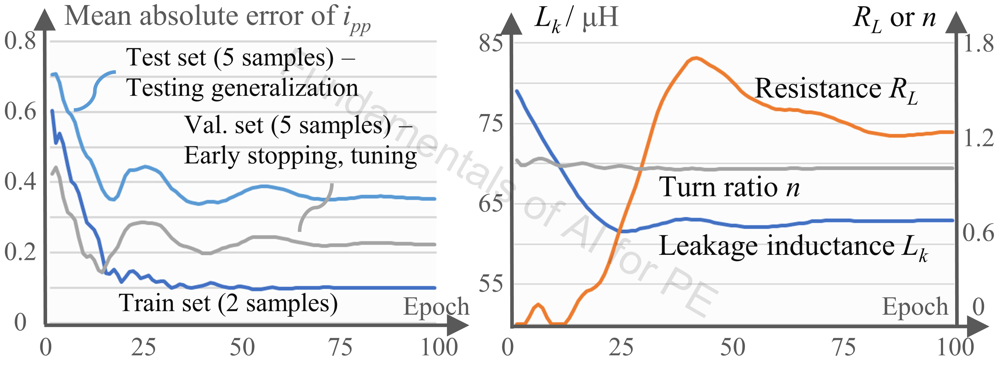
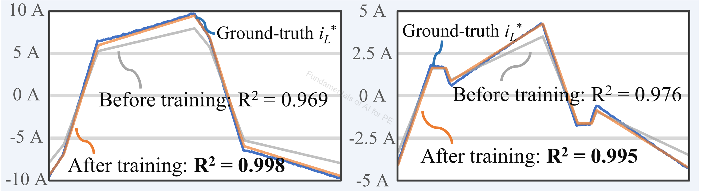

# 5_PIML / PANN

## Authorship & status

- **Course / code author:** Xinze Li  
- **Review article:** Xinze Li, Fanfan Lin, Juan J. Rodríguez-Andina, Sergio Vazquez, Homer Alan Mantooth, Leopoldo García Franquelo, “Fundamentals of Artificial Intelligence for Power Electronics,” *IEEE Transactions on Industrial Electronics*, 2026.

*These learning resources are still under active refinement; notebooks, data, and documentation may change.*

---

## Google Colab

This folder is a **bridge** to the external [PANN](https://github.com/XinzeLee/PANN) repository; there is no local `.ipynb` here. For Colab-ready PINN notebooks in *this* course repo, use the buttons on [`../README.md`](../README.md) (`PINN/pinn_ode.ipynb`, `PINN/pinn_pde.ipynb`, `PINN/prior_integration_example.ipynb`). **`pinn_ode.ipynb` and `pinn_pde.ipynb`** share the same training recipe in the loss: fixed sampling points, soft IC/BC (or IC + data for the ODE), scalar weights on each term, and Adam + optional L-BFGS.

---

## Alignment with the review article

**Discussion in the article:** **Sec. IV-B** (integrating prior knowledge into ML); **Sec. VII-E** (PANN for parameter identification).

This bridge document supports the **physics-in-architecture** thread in *Fundamentals of Artificial Intelligence for Power Electronics* (*IEEE Trans. Ind. Electron.*, 2026).

---

## Review article excerpt

> 

>   
> 

>
> 
<em>Figure 1. PANN-based parameter identification of DAB converters: the training profile.</em>

>
> 

>   
> 

>
> 
<em>Figure 2. Exemplary waveforms in the test set before and after training.</em>

>
> Figure 1 shows training of a **PANN** model—equivalent to **parameter identification** of a DAB converter (**Sec. VII-E**; physics-in-architecture prior, **Sec. IV-B**). Before identification, predicted **iL** deviates from measurements under the initial parameters. After training, identified parameters converge to **Lk = 62.9 μH**, **RL = 1.2 Ω**, and **n = 1**; reconstructed waveforms in Figure 2 show practical consistency with measurements.
>
> Hands-on code and tutorials: [XinzeLee/PANN](https://github.com/XinzeLee/PANN). Related DAB workflows in [`9_Case_Studies_PE/DAB_Design/`](../../9_Case_Studies_PE/DAB_Design/README.md). Contrast with PINN notebooks in [`../PINN/`](../README.md) (**physics in the loss**).

---

Bridge to the external **PANN** project and its role in physics-informed AI for power electronics.

## Official repository

- [XinzeLee/PANN](https://github.com/XinzeLee/PANN)

## What PANN is

**PANN** — **Physics-in-Architecture Neural Network**: PE-oriented modeling that bakes circuit / state-space structure into the network (often recurrent), aiming for:

- stronger physical consistency  
- lower data requirements  
- clearer interpretability of converter behavior  
- flexibility across operating points and topologies  

---

## External repository (summary)

**Positioning:** PE-focused “next step” modeling: explainable, data-light, compact networks; recurrent structure with physical meaning.

**Contents:** Model/training/util code; tutorials and notebooks; example data; training and adaptation scripts.

**Stated strengths:** Data-light training via physics priors; compact recurrent-style models; behavior tied to circuit principles; flexibility across modulation and operating conditions.

**Resources:** IEEE and related paper pointers in the upstream README; Colab links; clone + requirements + notebook workflow.

## Recommended learning sequence

1. Work through `5_PIML/PINN/` notebooks in this repo.  
2. Open [XinzeLee/PANN](https://github.com/XinzeLee/PANN) and read its [`README.md`](https://github.com/XinzeLee/PANN/blob/main/README.md).  
3. Tutorials and notebooks there before changing core model code.  
4. Contrast with PINN here: **physics in the loss** vs. **physics in architecture / inference**.

## Links

- Repository: [github.com/XinzeLee/PANN](https://github.com/XinzeLee/PANN)  
- README: [github.com/XinzeLee/PANN/blob/main/README.md](https://github.com/XinzeLee/PANN/blob/main/README.md)  
- Notebooks: [github.com/XinzeLee/PANN/tree/main/notebooks](https://github.com/XinzeLee/PANN/tree/main/notebooks)  
- Tutorials: [github.com/XinzeLee/PANN/tree/main/tutorials](https://github.com/XinzeLee/PANN/tree/main/tutorials)  
