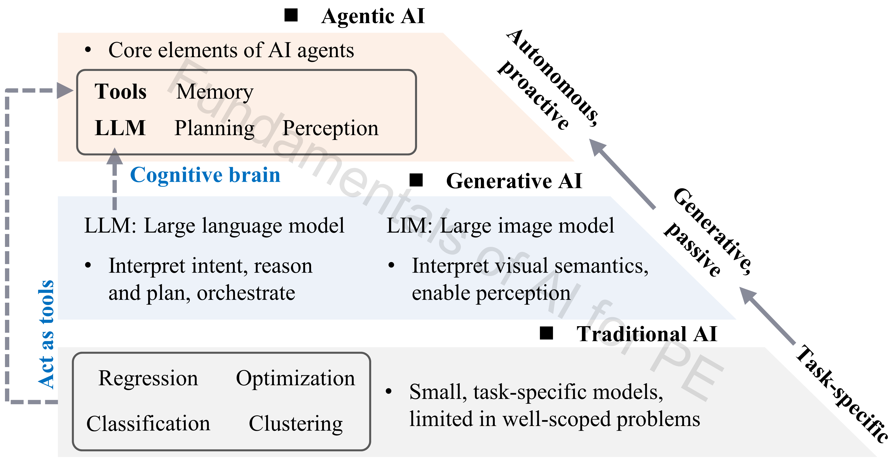

# 6_Agentic_AI

## Authorship & status

- **Course / code author:** Xinze Li  
- **Review article:** Xinze Li, Fanfan Lin, Juan J. Rodríguez-Andina, Sergio Vazquez, Homer Alan Mantooth, Leopoldo García Franquelo, “Fundamentals of Artificial Intelligence for Power Electronics,” *IEEE Transactions on Industrial Electronics*, 2026.

*These learning resources are still under active refinement; notebooks, data, and documentation may change.*

---

## Alignment with the review article

**Discussion in the article:** **Section VI** (VI-A generative AI basics; VI-B reactive → agentic leap; VI-C PE-GPT process automation).

This documentation folder supports the **agentic AI** discussion in *Fundamentals of Artificial Intelligence for Power Electronics* (*IEEE Trans. Ind. Electron.*, 2026).

---

## Review article excerpt

> 

>   
> 

>
> 
<em>Figure 1. Hierarchy toward agentic general intelligence for power electronics: traditional, generative, and agentic AI.</em>

>
> This figure presents a conceptual hierarchy from **traditional AI** to **generative AI** and then to **agentic AI** for power electronics:
>
> - **Traditional AI** — task-specific models for regression, classification, clustering, optimization, and related workflows; the modeling and decision-support layer for well-scoped PE problems (see modules `1_MHA`–`5_PIML`, `7_Reinforcement_Learning`, `9_Case_Studies_PE` in this repository).  
> - **Generative AI** — large language and multimodal models that interpret intent, reason, generate content, and understand visual semantics (**Section VI-A**).  
> - **Agentic AI** — integrates LLMs, tools, memory, and reasoning to move from reactive generation toward **proactive orchestration**, enabling more autonomous workflows for PE design, control, analysis, and lifecycle management (**Section VI-B – VI-C**).
>
> This part points to **[PE-GPT](https://github.com/XinzeLee/PE-GPT)** as a reference stack for agentic PE workflows.

---

Agentic AI for power-electronics workflows, with pointers to the external **PE-GPT** project.

## Official repository

- [XinzeLee/PE-GPT](https://github.com/XinzeLee/PE-GPT)
- [PE-GPT official website](https://fannie1803.github.io/pegpt.ai/)

## Outcomes

- Agentic workflow: LLM-led steps, tools, and PE design tasks  
- PE-GPT stack: LLM, RAG, model zoo, simulation hooks, optimization  
- Where domain knowledge, physics-based models, and automation meet  
- Example task classes: component selection, modulation optimization, parameter design  

## Notes

- PE-GPT is an **agentic-AI framework** (agent + tools + models), not a single foundational model.  
- Streamlit front end (`main.py`) and `requirements` files for setup.  
- After `5_PIML`: PINN/PANN ↔ zoo; `1_MHA` ↔ optimization layer; `8_PE_Simulation_Automation` ↔ verification loops.

## Recommended learning sequence

1. Local foundations: `1_MHA`, `4_Neural_Network`, `5_PIML`.  
2. Read [PE-GPT README](https://github.com/XinzeLee/PE-GPT/blob/main/README.md).  
3. Browse [core](https://github.com/XinzeLee/PE-GPT/tree/main/core) and [tutorial](https://github.com/XinzeLee/PE-GPT/tree/main/tutorial).  
4. Local stack: follow PE-GPT’s own setup instructions.

## References

- [PE-GPT](https://github.com/XinzeLee/PE-GPT)  
- [PE-GPT README](https://github.com/XinzeLee/PE-GPT/blob/main/README.md)  
