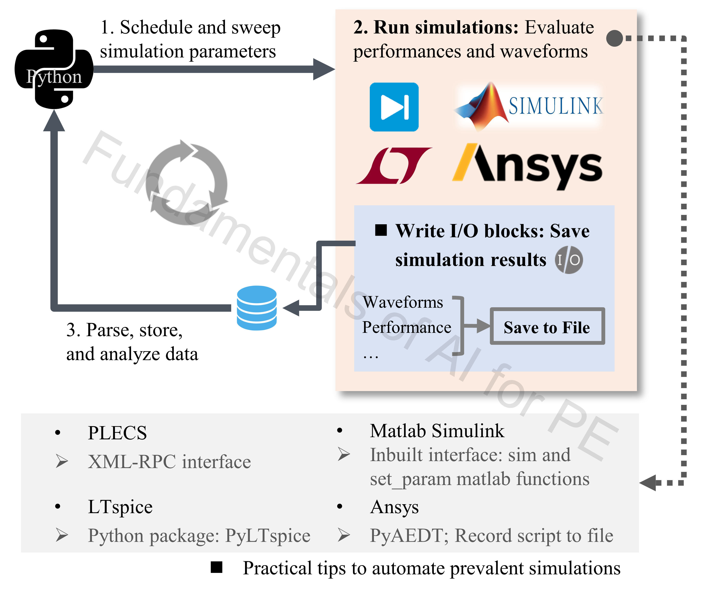

# 8_PE_Simulation_Automation

## Authorship & status

- **Course / code author:** Xinze Li  
- **Review article:** Xinze Li, Fanfan Lin, Juan J. Rodríguez-Andina, Sergio Vazquez, Homer Alan Mantooth, Leopoldo García Franquelo, “Fundamentals of Artificial Intelligence for Power Electronics,” *IEEE Transactions on Industrial Electronics*, 2026.

*These learning resources are still under active refinement; notebooks, data, and documentation may change.*

---

## Google Colab

The simulation automation notebooks cannot be implemented on Google Colab.

---

## Alignment with the review article

**Discussion in the article:** **Section III-A** (simulation automation for batch data acquisition).

The automation notebooks here illustrate the **data acquisition** loop described in *Fundamentals of Artificial Intelligence for Power Electronics* (*IEEE Trans. Ind. Electron.*, 2026).

---

## Review article excerpt

> 

>   
> 

>
> 
<em>Figure 1. Power electronics simulation automation.</em>

>
> This figure introduces a simple **iterative workflow** for simulation automation in power electronics. **Python** schedules and sweeps simulation parameters, while tools such as **PLECS**, **LTspice**, **MATLAB/Simulink**, and **Ansys** run the simulations and export waveforms or performance metrics through configured I/O interfaces. Results are **parsed, stored, and analyzed**, forming an automated loop for efficient **batch data acquisition** for ML modeling and optimization (**Sec. III-A**).
>
> This folder implements that pattern for three stacks: [`LTspiceAutomation/LTspiceAtuomate.ipynb`](LTspiceAutomation/LTspiceAtuomate.ipynb), [`PlecsAutomation/Data acquisition.ipynb`](PlecsAutomation/Data%20acquisition.ipynb), and [`SimulinkAutomation/BuckConverter_Automation.m`](SimulinkAutomation/BuckConverter_Automation.m). Downstream use cases include surrogates in [`2_Classic_ML/`](../2_Classic_ML/), [`4_Neural_Network/`](../4_Neural_Network/), and case studies in [`9_Case_Studies_PE/`](../9_Case_Studies_PE/).

---

Automation for PE simulation: batch runs, metrics extraction, and CSV-friendly outputs for downstream ML.

## Contents

| Kind | Path |
|------|------|
| LTspice | `LTspiceAutomation/LTspiceAtuomate.ipynb` — LTspice automation |
| Plecs | `PlecsAutomation/Data acquisition.ipynb` — Plecs automation |
| MATLAB | `SimulinkAutomation/BuckConverter_Automation.m` — Simulink automation |

## Outcomes

- Parameter sweeps driven from code instead of manual GUI sweeps  
- Waveforms and scalars in structured files (CSV) for training pipelines  
- Batch loops with timeout / error handling for large sweeps  
- Patterns portable toward optimization and surrogate modeling  
- Cross-tool perspective: LTspice, PLECS, Simulink, and similar Ansys-style flows  

---

### `LTspiceAutomation/LTspiceAtuomate.ipynb`

**Topics:** **PyLTSpice** — simulator binary and schematic paths; Cartesian parameter grids (`itertools.product`); batch transient runs via netlist parameters; `.raw` parsing; CSV export; plots and metrics (e.g. overshoot).

**Notes:** Pre-flight checks for simulator binary and schematic files; failed runs logged while the sweep continues.

---

### `PlecsAutomation/Data acquisition.ipynb`

**Topics:** **PLECS XML-RPC** automation; grid-search parameter grids and indexed helpers; worker threads with `func_timeout` timeouts; `Performance.csv` plus per-run `Waveform/*.csv`.

**Notes:** Timeouts, non-convergent-case handling, append-style result files for long jobs; output shape aligned with later ML/PIML notebooks.

---

### `SimulinkAutomation/BuckConverter_Automation.m`

**Topics:** MATLAB orchestration for the Simulink buck model — parallel to the LTspice/PLECS notebooks.

---

## Ansys-style workflows

A practical pattern for AEDT-class tools:

1. **Record Script to File** in the GUI for a working baseline.  
2. Refactor into parameterized functions or modules.  
3. **PyAEDT** (or similar) for sweeps, solves, and exports.

Recording a known-good GUI flow first, then generalizing, is usually the fastest path to reliable automation.

## Recommended learning sequence

1. LTspice notebook — local sweep mechanics.  
2. PLECS XML-RPC notebook — API-style remote control.  
3. Connect CSV/waveform outputs to ML or PIML scripts.  
4. Reuse the same ideas for Simulink or Ansys toolchains.
