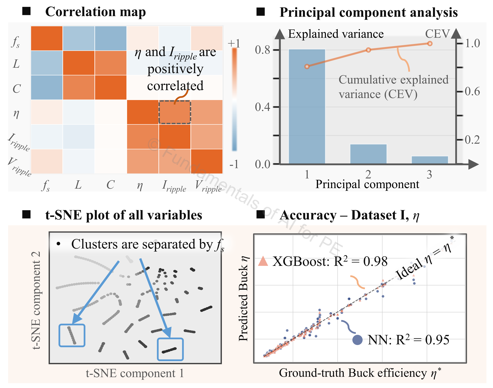
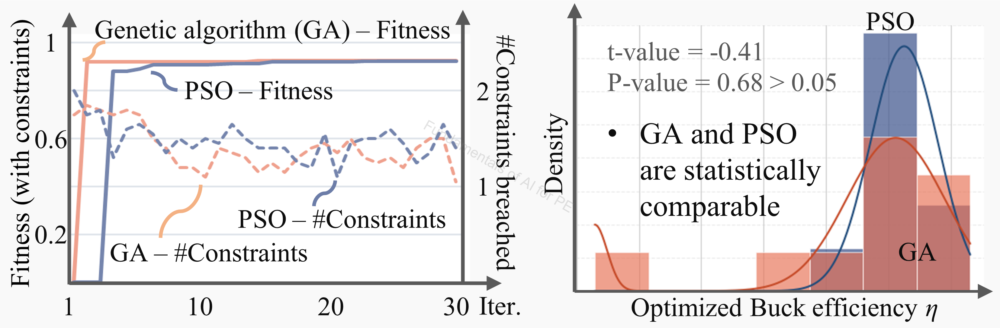

# Buck_Design

## Authorship & status

- **Course / code author:** Xinze Li  
- **Review article:** Xinze Li, Fanfan Lin, Juan J. Rodríguez-Andina, Sergio Vazquez, Homer Alan Mantooth, Leopoldo García Franquelo, “Fundamentals of Artificial Intelligence for Power Electronics,” *IEEE Transactions on Industrial Electronics*, 2026.

*These learning resources are still under active refinement; notebooks, data, and documentation may change.*

---

## Google Colab

  
  &nbsp;&nbsp;
  
  &nbsp;&nbsp;
  

---

## Alignment with the review article

**Discussion in the article:** **Section VII-A** (Exploratory data analysis); **VII-B** (ML surrogate modeling); **VII-C** (MHA optimization).

These notebooks support the **buck converter** one-stop case study in *Fundamentals of Artificial Intelligence for Power Electronics* (*IEEE Trans. Ind. Electron.*, 2026).

---

## Review article excerpt

> 

>   
> 

>
> 
<em>Figure 1. Correlation map, principal component analysis, t-SNE plot, and the accuracy of ML-based modeling for buck converters.</em>

>
> This case study has **two stages**: machine learning **surrogate modeling** and **meta-heuristic optimization**. Figure 1 summarizes the correlation map, **principal component analysis** of design variables (**fs**, **L**, **C**) and objectives (**η**, **Iripple**, **Vripple**), a **t-SNE** plot of all variables, and the accuracy of ML-based efficiency modeling.
>
> From the correlation map and PCA, all three design variables (**fs**, **L**, **C**) contribute nontrivially to the three objectives (**η**, **Iripple**, **Vripple**), so ML model inputs include **fs**, **L**, and **C**. In the accuracy plot, **XGBoost** reaches higher accuracy than the NN, illustrating strong performance of **tree-based ensemble** methods on tabular buck data—see [`buck_modeling_NN.ipynb`](buck_modeling_NN.ipynb), [`xgboost_buck_modeling.ipynb`](xgboost_buck_modeling.ipynb), and EDA in [`buck_comprehensive_case_study.ipynb`](buck_comprehensive_case_study.ipynb).
>
> 

>   
> 

>
> 
<em>Figure 2. Comparison between GA and PSO for buck circuit optimization.</em>

>
> Figure 2 presents the **fitness evolution** of **genetic algorithm (GA)** and **particle swarm optimization (PSO)** on the buck optimization task. In this case, **GA achieves comparable efficiency optimization performance** to PSO—implemented in [`buck_comprehensive_case_study.ipynb`](buck_comprehensive_case_study.ipynb) and [`xgboost_buck_modeling.ipynb`](xgboost_buck_modeling.ipynb) (**Section VII-C**).

---

## Dataset Description

**Buck dataset** — circuit parameters of buck converters

| Item | Description |
|------|-------------|
| **Topology** | Synchronous buck converter |
| **Jupyter Notebook** | [`buck_comprehensive_case_study.ipynb`](buck_comprehensive_case_study.ipynb) |
| **Operating range** | Input voltage **Vin** = 48 V, output voltage **Vout** = 12 V, rated power = 100 W |
| **Power electronics task** | Optimize LC filter for synchronous buck converters |
| **Design variables** | **switching frequency fs** ∈ [10 kHz, 200 kHz], inductance **L**, capacitance **C** |
| **Objectives / Constraints** | **Objective:** Maximize efficiency **Constraints:** Voltage ripple < 1%, current ripple < 10%, LC filter volume < 7 cm³ |

**AI solutions**

1. **Stage 1 — ML surrogate modeling** for efficiency, voltage ripple, and current ripple  
   - **ML model inputs:** **fs**, **L**, **C**  
   - **ML model outputs:** efficiency, voltage ripple, current ripple  

2. **Stage 2 — MHA optimization** to improve efficiency while satisfying ripple and volume constraints  
   - **MHA input space:** **fs**, **L**, **C**  
   - **MHA objective space:** objective function that maximizes efficiency with ripples and volume as additional penalty terms  

---

Synchronous buck design: data analysis, surrogate modeling, and metaheuristic optimization.

## Contents

- `buck_comprehensive_case_study.ipynb`  
- `buck_modeling_NN.ipynb`  
- `xgboost_buck_modeling.ipynb`  
- `total_100W_12V.csv`, `sync_buck_performances_cleaned.csv`

## Outcomes

- EDA and multi-objective screening before optimization  
- Compare classical ensembles, XGBoost, and FNN surrogates on efficiency / ripple  
- Surrogate-assisted PSO and GA over design objectives  
- Outlier handling and correlation diagnostics on tabular buck data  

---

### `buck_comprehensive_case_study.ipynb`

**Topics:** EDA, objectives, lookup / screening, surrogate training, PSO vs. GA over surrogate objectives.

**Algorithms & data:** FNN surrogates, PSO, GA, classical baselines in analysis. `total_100W_12V.csv` and derived loss/ripple-style targets.

**Notes:** Multi-objective; outlier handling; correlation and distribution diagnostics before optimization.

---

### `buck_modeling_NN.ipynb`

**Topics:** Efficiency modeling — EDA, Random Forest / XGBoost, deeper MLP surrogate with regularization and scheduler, prediction surfaces.

**Algorithms & data:** RandomForestRegressor, XGBoost, FNN, t-SNE. `sync_buck_performances_cleaned.csv`.

**Notes:** Scaled inputs; train/val/test; R², RMSE, MAE, loss curves.

---

### `xgboost_buck_modeling.ipynb`

**Topics:** Efficiency and ripple via XGBoost; training diagnostics; optimization stage driven by trained surrogates.

**Algorithms & data:** `XGBRegressor`, Random Forest baseline, MHA stage. `sync_buck_performances_cleaned.csv` with engineered ripple target.

**Notes:** Outlier filtering; prediction vs. actual and round-wise curves.

---

## Algorithm summary

- Random Forest, XGBoost, FNN/MLP surrogates  
- PSO, GA
- t-SNE, correlation / outlier analysis  

## Data summary

- `total_100W_12V.csv` — comprehensive case study
- `sync_buck_performances_cleaned.csv` — efficiency and ripple modeling notebooks  

## Recommended learning sequence

1. `buck_comprehensive_case_study.ipynb`  
2. `buck_modeling_NN.ipynb`  
3. `xgboost_buck_modeling.ipynb`  
