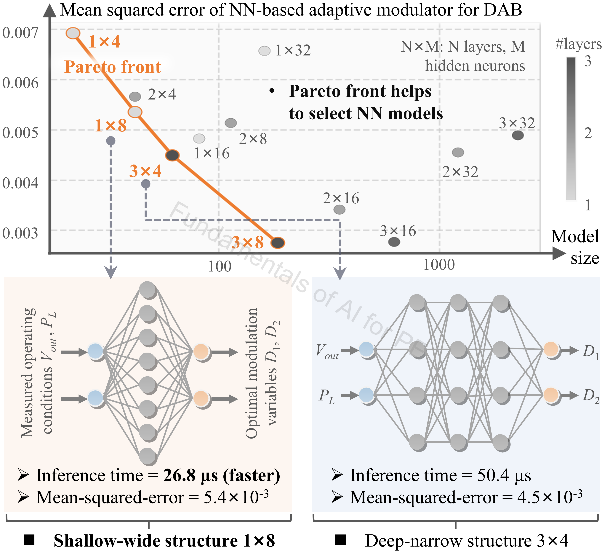

# Adaptive_Modulation

## Authorship & status

- **Course / code author:** Xinze Li  
- **Review article:** Xinze Li, Fanfan Lin, Juan J. Rodríguez-Andina, Sergio Vazquez, Homer Alan Mantooth, Leopoldo García Franquelo, “Fundamentals of Artificial Intelligence for Power Electronics,” *IEEE Transactions on Industrial Electronics*, 2026.

*These learning resources are still under active refinement; notebooks, data, and documentation may change.*

---

## Google Colab

  

---

## Alignment with the review article

**Discussion in the article:** **Section VII-D** (TinyML for PE control and deployment).

This notebook supports the **DAB adaptive modulation / edge deployment** case study in *Fundamentals of Artificial Intelligence for Power Electronics* (*IEEE Trans. Ind. Electron.*, 2026). 

---

## Review article excerpt

> 

>   
> 

>
> 
<em>Figure 1. NN structure selection for online adaptive modulation leveraging the Pareto front of model size versus mean squared error.</em>

>
> Figure 1 illustrates how to select an **NN-based controller** by comparing model accuracy and model size (**Section VII-D**). Different architectures are evaluated by varying hidden layers and neuron counts; candidates are plotted in **accuracy–size** space. The **Pareto front** highlights models with the best trade-offs between lower **mean squared error (MSE)** and smaller footprint.
>
> For NNs with comparable size and accuracy, a **shallow-wide** structure is often preferred over **deep-narrow** when accuracy is similar—fewer sequential layers reduce **inference latency** and support faster real-time deployment. This workflow is implemented in [`TinyML.ipynb`](TinyML.ipynb).

---

TinyML-oriented DAB modulation: neural network structure sweeps, compression, and ONNX-based inference timing.

## Contents

- `TinyML.ipynb`  
- `optimization_results.csv`

## Outcomes

- Modulation-oriented FNN with Pareto-style **size vs. loss** tradeoffs  
- **Pruning**, **ONNX** export, and **dynamic quantization** for edge inference  
- Interpret speed/accuracy tradeoffs for deployable DAB controllers  

---

### `TinyML.ipynb`

**Topics:** Modulation-oriented NN; NN structure sweeps and Pareto-style size vs. loss; L1, pruning, ONNX, timing, quantization.

**Algorithms & data:** FNN mapping, Pareto selection, pruning, ONNX Runtime, dynamic quantization. `optimization_results.csv`.

**Notes:** Speed/accuracy tradeoffs; small-footprint inference. Complements the modulation optimization segment in [`one_stop_AI_DAB_modulation.ipynb`](../Performance_Modeling_and_Design/one_stop_AI_DAB_modulation.ipynb).

---

## Algorithm summary

- FNN / MLP  
- L1 regularization; pruning  
- ONNX Runtime; dynamic quantization  

## Data summary

- `optimization_results.csv` — optimized modulation parameters under different operating conditions  

## Recommended learning sequence

1. [`Performance_Modeling_and_Design/one_stop_AI_DAB_modulation.ipynb`](../Performance_Modeling_and_Design/one_stop_AI_DAB_modulation.ipynb) *(surrogate modeling and modulation optimization)*  
2. `TinyML.ipynb`  
