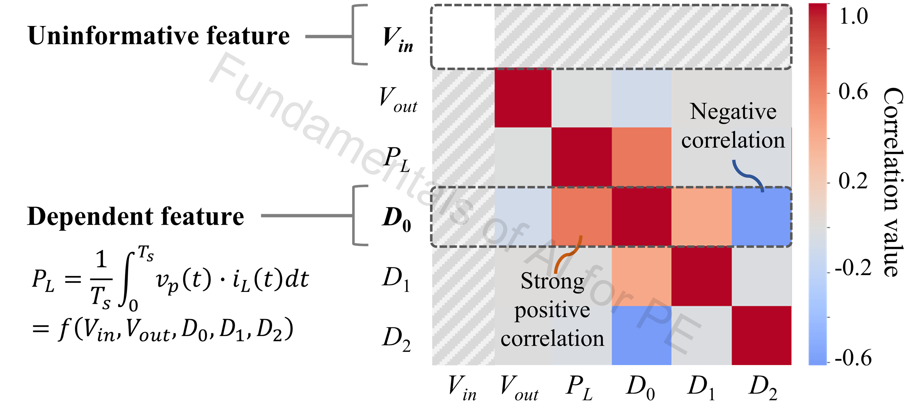
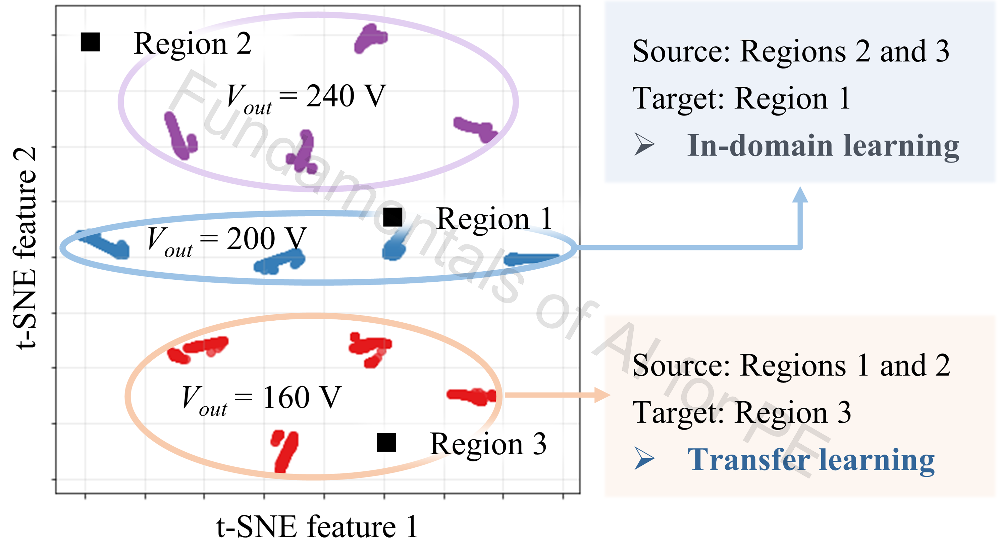
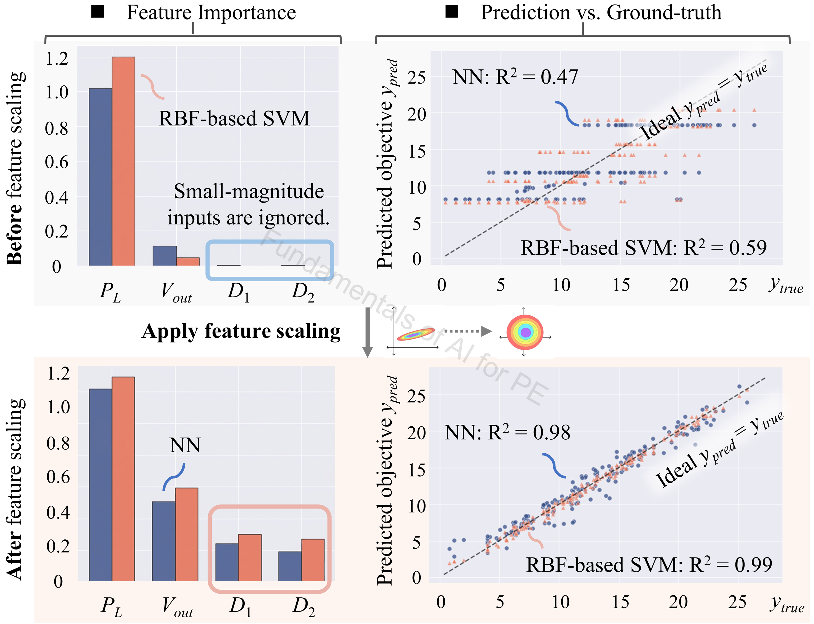
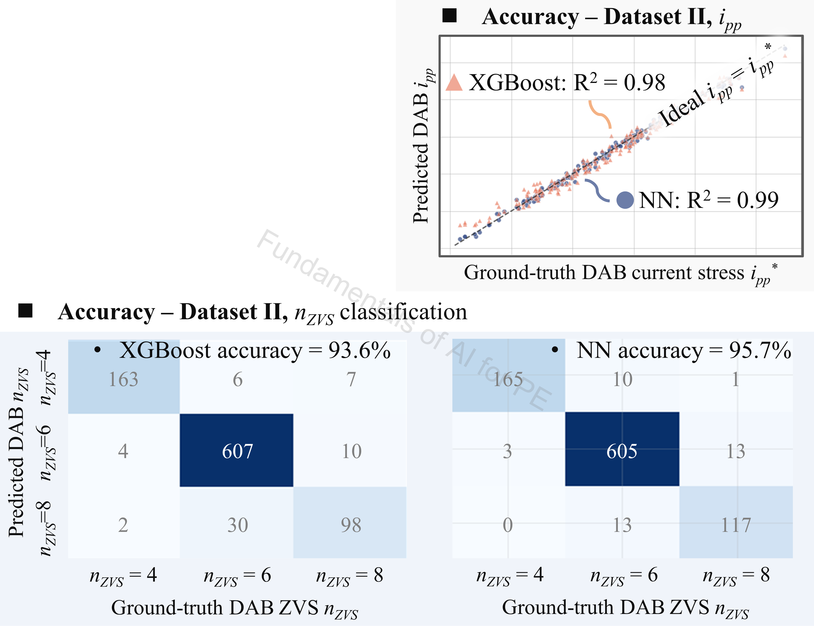
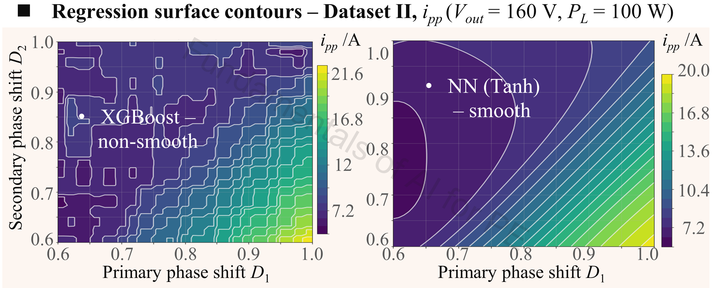
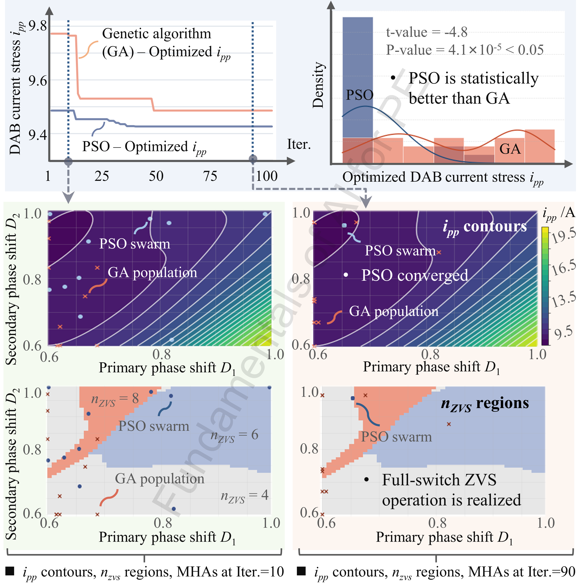

# Performance_Modeling_and_Design

## Authorship & status

- **Course / code author:** Xinze Li  
- **Review article:** Xinze Li, Fanfan Lin, Juan J. Rodríguez-Andina, Sergio Vazquez, Homer Alan Mantooth, Leopoldo García Franquelo, “Fundamentals of Artificial Intelligence for Power Electronics,” *IEEE Transactions on Industrial Electronics*, 2026.

*These learning resources are still under active refinement; notebooks, data, and documentation may change.*

---

## Google Colab

  

---

## Alignment with the review article

**Discussion in the article:** **Sec. VII-A** (EDA); **VII-B** (surrogate modeling); **VII-C** (MHA optimization).

This notebook supports the **DAB performance modeling and design** thread in *Fundamentals of Artificial Intelligence for Power Electronics* (*IEEE Trans. Ind. Electron.*, 2026). Parent overview: [`../README.md`](../README.md) · [`../../README.md`](../../README.md).

---

## Review article excerpt

> 

>   
> 

>
> 
<em>Figure 1. Correlation heatmap in DAB modulation design.</em>

>
> Figure 1 shows the **correlation map** of available input variables in DAB **modulation optimization**. The input-voltage row implies that **Vin** is an uninformative feature. The **outer phase-shift** row indicates strong dependencies on the remaining variables—consistent with constraints from the power-transfer relation. This figure motivates removing **Vin** and **D0** from the feature set in [`one_stop_AI_DAB_modulation.ipynb`](one_stop_AI_DAB_modulation.ipynb).
>
> 

>   
> 

>
> 
<em>Figure 2. t-SNE feature space.</em>

>
> Figure 2 uses **t-SNE** to visualize the high-dimensional data manifold of DAB modulation optimization. Projecting operating samples into a low-dimensional space reveals **clusters**, helping assess data sparsity, dataset completeness, and distribution similarity. t-SNE supports deciding whether a PE modeling task is mainly **interpolation** within one operating domain or **transfer learning** across shifted conditions. Here, **Region 1** is an in-domain case when Regions 2 and 3 are source data; **Region 3** is a transfer-learning case when the model is trained on Regions 1 and 2.
>
> 

>   
> 

>
> 
<em>Figure 3. Accuracy of RBF-based SVM and NN models for DAB current-stress modeling, with and without feature scaling.</em>

>
> Figure 3 highlights the importance of **feature scaling** when PE features differ by orders of magnitude. Scaling brings variables to comparable magnitudes. For **DAB current-stress** modeling, without scaling, **RBF-SVM** and **NN** models can be dominated by high-variance features, causing biased learning and poor accuracy.
>
> 

>   
> 

>
> 
<em>Figure 4. Accuracy of XGBoost and NN models for DAB current-stress and zero voltage switching modeling.</em>

>
> Figure 4 reports accuracy for **current stress** and **zero-voltage switching (ZVS)** modeling. NNs reach **comparable or slightly higher** accuracy than XGBoost baselines when good practices are used—e.g. early stopping and normalization layers (**Sec. III-G**).
>
> 

>   
> 

>
> 
<em>Figure 5. Regression surface contours of XGBoost and NN (Tanh activation) models.</em>

>
> Figure 5 shows **regression surface contours** after training to assess model smoothness. **XGBoost** produces axis-aligned, non-smooth contours from its tree backbone. An **NN with Tanh** activations yields smoother surfaces; with **ReLU**, contours become piecewise linear.
>
> 

>   
> 

>
> 
<em>Figure 6. GA and PSO for DAB modulation optimization (Vout = 160 V, PL = 300 W).</em>

>
> Trained ML surrogates then couple to **GA** and **PSO** (**Sec. VII-C**). Peak current stress **ipp** is minimized subject to full **ZVS** (nZVS = 8). In the continuous search over **D1**, **D2**, **PSO** outperforms **GA** in convergence speed and final objective. Twenty repeated runs and a two-sample **t-test** give *P* = 4.1×10−4, confirming a statistically significant improvement.

---

One-stop DAB pipeline: exploratory analysis, data quality control, surrogate training, and metaheuristic optimization on tabular modulation data.

## Contents

- `one_stop_AI_DAB_modulation.ipynb`  
- `DAB_TPS.csv`  
- `utils.py`

## Outcomes

- EDA, PCA, and t-SNE on DAB modulation / performance tables  
- Outlier and validity screening (e.g. ZVS-style filters) before modeling  
- Compare XGBoost, Random Forest, SVR, and neural surrogates  
- Surrogate-assisted **PSO** and **GA** over modulation objectives  

---

### `one_stop_AI_DAB_modulation.ipynb`

**Topics:** Full DAB pipeline — EDA, cleaning, t-SNE/PCA, One-Class SVM and Isolation Forest, surrogate comparisons, PSO/GA, adaptive modulation / TinyML segment.

**Algorithms & data:** XGBoost, Random Forest, SVR, PCA, t-SNE, One-Class SVM, Isolation Forest, FNN-style models, PSO, GA. `DAB_TPS.csv`.

**Notes:** Quality control before optimization (validity, ZVS-style filters, outliers); shared plotting/analysis helpers in `utils.py`.

---

## Algorithm summary

- XGBoost, Random Forest, SVR, FNN  
- PCA, t-SNE; One-Class SVM, Isolation Forest  
- PSO, GA (surrogate-assisted search)  

## Data summary

- `DAB_TPS.csv` — tabular DAB modulation / performance features and targets  

## Recommended learning sequence

1. `one_stop_AI_DAB_modulation.ipynb`  
2. Continue with [`Time_Domain_Modeling/`](../Time_Domain_Modeling/README.md) or [`Adaptive_Modulation/`](../Adaptive_Modulation/README.md) as needed  
