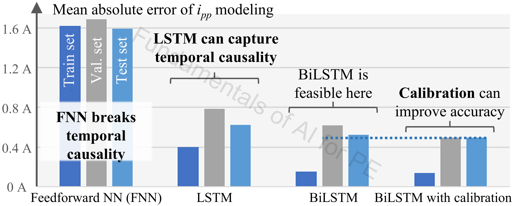
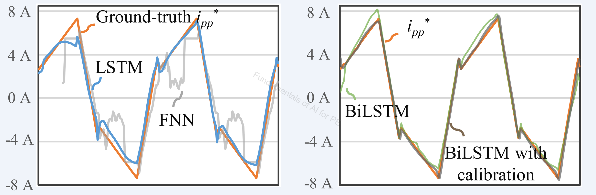

# Time_Domain_Modeling

## Authorship & status

- **Course / code author:** Xinze Li  
- **Review article:** Xinze Li, Fanfan Lin, Juan J. Rodríguez-Andina, Sergio Vazquez, Homer Alan Mantooth, Leopoldo García Franquelo, “Fundamentals of Artificial Intelligence for Power Electronics,” *IEEE Transactions on Industrial Electronics*, 2026.

*These learning resources are still under active refinement; notebooks, data, and documentation may change.*

---

## Google Colab

  

---

## Alignment with the review article

**Discussion in the article:** **Sec. VII-B** (sequence / surrogate modeling on signal-domain DAB waveforms).

This notebook supports the **DAB time-domain** case study in *Fundamentals of Artificial Intelligence for Power Electronics* (*IEEE Trans. Ind. Electron.*, 2026). Parent overview: [`../README.md`](../README.md) · [`../../README.md`](../../README.md).

---

## Review article excerpt

> 

>   
> 

>
> 
<em>Figure 1. NNs for DAB converter time-domain modeling.</em>

>
> 

>   
> 

>
> 
<em>Figure 2. Exemplary waveforms in the test set.</em>

>
> This case study covers **time-domain modeling** of DAB converters. Model inputs are voltage waveforms **vp** and **vs**; the output is the current waveform **iL**. As shown in Figure 1, four networks are trained in [`time_series_modeling.ipynb`](time_series_modeling.ipynb): **FNN**, **LSTM**, **BiLSTM**, and **BiLSTM with calibration**. Exemplary test-set waveforms appear in Figure 2.
>
> The large errors of the **FNN** show that a feedforward structure does not capture **temporal causality** in signal-domain data. **LSTM** and **BiLSTM** recurrent models handle waveforms more appropriately. Further gains come from **calibrating** waveforms to the rising edge of **vp**, which reduces phase ambiguity—aligned with **Sec. II-B** (signal-domain data) and [`4_Neural_Network/Signal_Domain/`](../../../4_Neural_Network/Signal_Domain/).

---

Sequence models for DAB waveform CSVs: loading, alignment, recurrent architectures, and test-set evaluation.

## Contents

- `time_series_modeling.ipynb`  
- `Waveform/*.csv` (bundled waveform library)

## Outcomes

- Load and preprocess DAB waveform time series  
- Train RNN / LSTM / BiLSTM-style models with train/val/test splits  
- Compare prediction accuracy (e.g. MAE) against measured waveforms  
- Relate signal-domain modeling to **Sec. II-B** concepts in [`4_Neural_Network/Signal_Domain/`](../../../4_Neural_Network/Signal_Domain/)  

---

### `time_series_modeling.ipynb`

**Topics:** Waveform CSV loading, alignment/segmentation, recurrent models, accuracy/MAE.

**Algorithms & data:** RNN/LSTM/BiLSTM-style PyTorch models. `Waveform/*.csv`.

**Notes:** Train/val/test; best checkpoint; prediction vs. measured waveforms.

---

## Algorithm summary

- RNN, LSTM, BiLSTM (PyTorch)  
- Windowed sequence preprocessing  

## Data summary

- `Waveform/*.csv` — DAB time-domain waveforms (100 bundled files)  

## Recommended learning sequence

1. [`Performance_Modeling_and_Design/one_stop_AI_DAB_modulation.ipynb`](../Performance_Modeling_and_Design/one_stop_AI_DAB_modulation.ipynb) *(tabular EDA and surrogates first, recommended)*  
2. `time_series_modeling.ipynb`  
