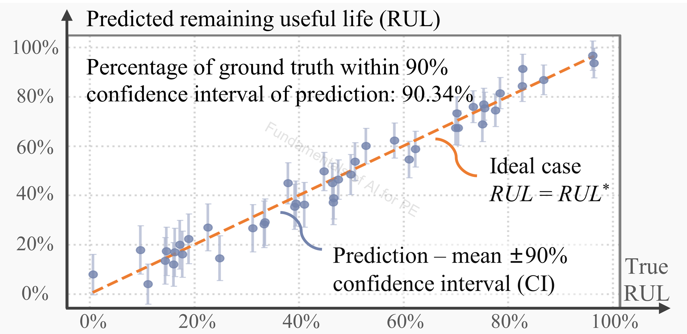
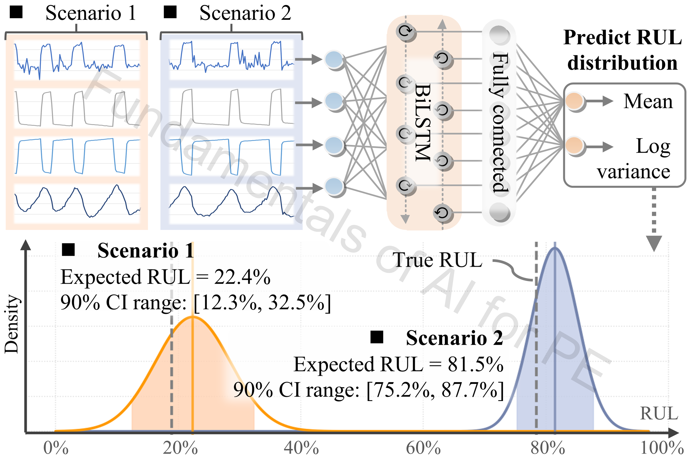

# IGBT_Maintenance

## Authorship & status

- **Course / code author:** Xinze Li  
- **Review article:** Xinze Li, Fanfan Lin, Juan J. Rodríguez-Andina, Sergio Vazquez, Homer Alan Mantooth, Leopoldo García Franquelo, “Fundamentals of Artificial Intelligence for Power Electronics,” *IEEE Transactions on Industrial Electronics*, 2026.

*These learning resources are still under active refinement; notebooks, data, and documentation may change.*

---

## Google Colab

  

---

## Alignment with the review article

**Discussion in the article:** **Section VII-F** (probabilistic remaining useful life prediction).

This notebook supports the **IGBT maintenance / RUL** case study in *Fundamentals of Artificial Intelligence for Power Electronics* (*IEEE Trans. Ind. Electron.*, 2026).

---

## Review article excerpt

> 

>   
> 

>
> 
<em>Figure 1. Probabilistic BiLSTM to predict RUL and quantify uncertainty: RUL accuracy and confidence interval.</em>

>
> 

>   
> 

>
> 
<em>Figure 2. Workflow of the probabilistic BiLSTM and case studies.</em>

>
> This case study presents **probabilistic RUL prediction** for **IGBT aging** using a neural network (**Section VII-F**). Instead of a single remaining-useful-life value, the model outputs an **expected RUL** and an **uncertainty range**. Figure 1 compares the predicted mean with true RUL; the **90% confidence interval** quantifies prediction uncertainty.
>
> Figure 2 outlines the workflow: electrical and thermal signals (node voltages, collector–emitter current, package temperature) feed a **BiLSTM** backbone. The head predicts a **Gaussian RUL distribution** via **mean** and **log-variance** outputs. Training with **negative log-likelihood** loss learns both the RUL trend and input-dependent uncertainty—supporting reliability-aware maintenance with an expected lifetime and a confidence range for decision-making. See [`rul_prediction.ipynb`](rul_prediction.ipynb) and the [NASA IGBT accelerated-aging dataset](https://data.nasa.gov/dataset/insulated-gate-bipolar-transistor-igbt-accelerated-aging).

---

## Dataset Description

**IGBT maintenance dataset** — remaining useful life prediction of IGBT devices under thermal stress

| Item | Description |
|------|-------------|
| **Jupyter Notebook** | [`rul_prediction.ipynb`](rul_prediction.ipynb) |
| **Task** | Predict the remaining useful life of IGBT devices while quantifying uncertainty |

**AI solutions — probabilistic NN with Gaussian model head for remaining useful life estimation**

- **Neural network inputs:** two node voltages, collector–emitter current, and package temperature of the IGBT under test  
- **Neural network outputs:** mean of RUL, log variance of the RUL  

---

Probabilistic remaining useful life (RUL) from accelerated-aging IGBT measurements.

## External dataset

| Source | Link |
|--------|------|
| NASA — Insulated Gate Bipolar Transistor (IGBT) accelerated aging | [data.nasa.gov — IGBT accelerated aging](https://data.nasa.gov/dataset/insulated-gate-bipolar-transistor-igbt-accelerated-aging) |

The bundled `april22nd-23rdIgbtIRCG40BC30kd-A17.mat` is aligned with this dataset for tutorial use; refer to NASA for citation requirements.

## Contents

- `rul_prediction.ipynb`  
- `april22nd-23rdIgbtIRCG40BC30kd-A17.mat`

## Outcomes

- Load and window cycle-based features from `.mat` aging data  
- Train a probabilistic sequence model (BiLSTM) with uncertainty intervals  
- Report point error and interval coverage (e.g. 90% confidence interval) on the test set  

---

### `rul_prediction.ipynb`

**Topics:** RUL from `.mat` data; cycle/minima extraction and windowing; probabilistic BiLSTM; uncertainty bands.

**Algorithms & data:** Probabilistic BiLSTM with Gaussian NLL. `april22nd-23rdIgbtIRCG40BC30kd-A17.mat` (from NASA IGBT accelerated aging data — [dataset page](https://data.nasa.gov/dataset/insulated-gate-bipolar-transistor-igbt-accelerated-aging)).

**Notes:** Scaler fit on train; point error plus interval coverage (e.g. 90% CI).

---

## Algorithm summary

- Probabilistic BiLSTM (Gaussian NLL loss)  
- Cycle / minima feature extraction and windowing  

## Data summary

- `april22nd-23rdIgbtIRCG40BC30kd-A17.mat` — see [NASA IGBT accelerated aging](https://data.nasa.gov/dataset/insulated-gate-bipolar-transistor-igbt-accelerated-aging)  

## Recommended learning sequence

1. `rul_prediction.ipynb`  
