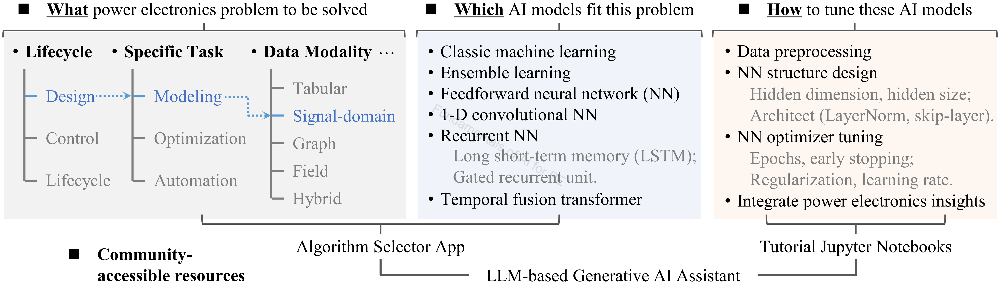

# Fundamentals of AI for PE — repository overview

<!-- traffic:start -->
<p align="center">
  <a href="https://github.com/XinzeLee/Fundamentals_of_AI_for_PE/graphs/traffic">
    
  </a>
  <a href="https://github.com/XinzeLee/Fundamentals_of_AI_for_PE/graphs/traffic">
    
  </a>
  <a href="https://github.com/XinzeLee/Fundamentals_of_AI_for_PE/graphs/traffic">
    
  </a>
</p>

<p align="center"><sub>Github traffic (monitoring started on May, 23, 2026) · cumulative tracked totals · Till 2026-06-15 UTC</sub></p>
<!-- traffic:end -->

## Support & citation

If this repository is useful to you, please give it a Star ⭐! Your Support means a lot to us! To cite this work:

```
X. Li, F. Lin, J. J. Rodríguez-Andina, S. Vazquez, H. A. Mantooth, and L. García Franquelo,
"Fundamentals of Artificial Intelligence for Power Electronics," IEEE Trans. Ind. Electron., 2026.
```

## Companion tools

Use the interactive **Algorithm Selector** to narrow AI/ML approaches for your PE task, and the **ChatGPT** tutor for deeper Q&A and resource-rich reports aligned with this course.

<p align="center">
  <a href="https://xinzelee.github.io/AI_for_PE_Algorithm_Selector/">
    
  </a>
  &nbsp;&nbsp;
  <a href="https://chatgpt.com/g/g-698618895c2481919e113c49bafe23ee-fundamentals-of-ai-for-pe">
    
  </a>
</p>

<p align="center">
  <sub>Source code for the selector: <a href="https://github.com/XinzeLee/AI_for_PE_Algorithm_Selector">XinzeLee/AI_for_PE_Algorithm_Selector</a></sub>
</p>

---

## Alignment with the review article

This repository accompanies the invited review *Fundamentals of Artificial Intelligence for Power Electronics* (*IEEE Trans. Ind. Electron.*, 2026). Section numbers below follow the **revised manuscript** structure:

| Article section | Topic |
|-----------------|---------------|
| **I** | Introduction |
| **II** | Basics of PE data (tabular, signal, field, graph, unstructured) |
| **III** | Fundamentals of ML for PE (simulation automation, EDA, preprocessing, learning types, architectures, NNs, good practices) |
| **IV** | Fundamentals of PIML for PE |
| **V** | Fundamentals of MHAs for PE optimization |
| **VI** | Agentic AI (including PE-GPT) |
| **VII** | One-stop AI applications throughout the PE lifecycle |
| **VIII** | Conclusion and outlook |

**Folder ↔ article mapping**

| Folder | Article sections |
|--------|------------------|
| [`0_To_Get_Started`](0_To_Get_Started/) | Prerequisite environment; supports hands-on material across the paper |
| [`1_MHA`](1_MHA/) | **V** — `Single_Objective_MHA/`: V-A, V-C; `Multi_Objective_MHA/`: V-B, V-C |
| [`2_Classic_ML`](2_Classic_ML/) | **III-B – III-E** (EDA, preprocessing, learning types, ML architectures) |
| [`3_Ensemble_Learning`](3_Ensemble_Learning/) | **III-E** (tree / ensemble architectures) |
| [`4_Neural_Network`](4_Neural_Network/) | **II** (modalities) + **III-F – III-G** — see [4_Neural_Network/README.md](4_Neural_Network/README.md) |
| [`5_PIML`](5_PIML/) | **IV** (IV-A – IV-C) |
| [`6_Agentic_AI`](6_Agentic_AI/) | **VI** (VI-A – VI-C) |
| [`7_Reinforcement_Learning`](7_Reinforcement_Learning/) | **III-D** (reinforcement learning) |
| [`8_PE_Simulation_Automation`](8_PE_Simulation_Automation/) | **III-A** (simulation automation for batch data acquisition) |
| [`9_Case_Studies_PE`](9_Case_Studies_PE/) | **VII** — see [9_Case_Studies_PE/README.md](9_Case_Studies_PE/README.md) and case-study READMEs below |

---

## Review article excerpt

> <p align="center">
>   
> </p>
>
> <p align="center"><em>Figure 1. “What–Which–How” framework to introduce the fundamentals of AI for PE.</em></p>
>
> The IEEE TIE review article "Fundamentals of Artificial Intelligence for Power Electronics", together with this repository (**hands-on Jupyter notebooks**), the [Algorithm Selector](https://xinzelee.github.io/AI_for_PE_Algorithm_Selector/) web app, and [ChatGPT assistant](#companion-tools), supports a practical **What–Which–How** framework for introducing AI fundamentals in power electronics.
>
> 1. **What** — clarify the PE problem you want to solve.  
> 2. **Which** — select suitable AI models, from classic machine learning and ensemble learning to neural-network architectures (and related topics in this repo).  
> 3. **How** — tune and deploy those models through guided, hands-on coding.
>
> The framework aims to make AI methods more **accessible** and **actionable** for the PE community.

---

## Companion education article (pilot course)

**[Reforming Power Electronics Education in the Era of AI: A Pilot Course by the University of Arkansas Power Group](docs/Reforming%20Power%20Electronics%20Education%20in%20the%20Era%20of%20AI.pdf)** — Xinze Li and H. Alan Mantooth ([`docs/`](docs/)).

**Conclusion:** Effective AI-for-PE education should build **domain-grounded judgment**—not generic AI training alone. The authors call on **students, educators, industry, and public funders** to advance PE-relevant curricula, workforce training, responsibly shareable data, and supporting policy. The PDF frames this repository and the [companion tools](#companion-tools) at the top of this README as practical pieces of that wider effort; see the PDF for the full argument and references.

---

## Authorship & status

- **Course / code author:** Xinze Li  
- **Review article:** Xinze Li, Fanfan Lin, Juan J. Rodríguez-Andina, Sergio Vazquez, Homer Alan Mantooth, Leopoldo García Franquelo, “Fundamentals of Artificial Intelligence for Power Electronics,” *IEEE Transactions on Industrial Electronics*, 2026.

*These learning resources are still under active refinement; notebooks, data, and documentation may change.*

---

## Navigate this README

| Section | Jump to |
|--------|---------|
| Support & citation | [Star & cite this work](#support--citation) |
| Companion tools | [Algorithm selector & ChatGPT](#companion-tools) |
| Article ↔ repo mapping | [Alignment with the review article](#alignment-with-the-review-article) · [Case studies (Sec. VII)](#case-studies-sec-vii) |
| What–Which–How framework | [Review article excerpt](#review-article-excerpt) |
| Education article (PDF) | [Companion education article](#companion-education-article-pilot-course) |
| Google Colab | [Colab links for all notebooks](#google-colab) |
| Repository metrics | [Overview](#overview) |
| Module folders & learning path | [1. Contents and learning path](#1-contents-and-learning-path) |
| Algorithm & data inventory | [2. Algorithms and data](#2-algorithms-and-data) → [2.1 Algorithms](#21-algorithms) · [2.2 Data](#22-data) |

Structured summary of topics, code volume, data assets, and algorithm coverage across Jupyter notebooks (`.ipynb`).

## Google Colab

Each module README includes **Open in Colab** badges for its notebooks. On Colab, the usual first code cell clones this repository to `/content/Fundamentals_of_AI_for_PE`, runs `pip install -r requirements.txt`, and sets the working directory to the notebook’s folder so paths resolve. **Exception:** [`8_PE_Simulation_Automation`](8_PE_Simulation_Automation/) relies on local simulators (LTspice, PLECS, etc.) and is not intended for Colab.

## Overview

| Metric | Value |
|---|---:|
| Code lines (notebook cells) | **11,950** |
| Jupyter notebooks | **31** |
| PE-oriented dataset families | **7** |
| Algorithm labels | **25** |

**Summary:** Teaching-oriented AI-for-power-electronics material.

## 1. Contents and algorithm learning path

| Folder | Notebooks | Code lines | Role |
|--------|---:|---:|------|
| [`0_To_Get_Started`](0_To_Get_Started/) | 1 | 306 | Environment setup and package checks |
| [`1_MHA`](1_MHA/) | 5 | 1,721 | Single- and multi-objective metaheuristic optimization (**Sec. V**) |
| [`2_Classic_ML`](2_Classic_ML/) | 3 | 559 | Polynomial Ridge (synthetic), classical classification, GP regression & Bayesian optimization (**Sec. III**) |
| [`3_Ensemble_Learning`](3_Ensemble_Learning/) | 1 | 555 | Tree and ensemble methods (**Sec. III-E**) |
| [`4_Neural_Network`](4_Neural_Network/) | 5 | 2,283 | NN fundamentals, 3D thermal field regression (`Field_Data/`), signal-domain waveform regression (`Signal_Domain/`), good practices, MDN / hysteresis; [`Graph_NN/`](4_Neural_Network/Graph_NN/) resources (**Sec. II–III**) |
| [`5_PIML`](5_PIML/) | 3 | 1,000 | Physics-informed modeling (`PINN/`); PANN summary in [`PANN/`](5_PIML/PANN/) (**Sec. IV; VII-E**) |
| [`6_Agentic_AI`](6_Agentic_AI/) | — | — | Agentic AI and PE-GPT (documentation; no local `.ipynb`) (**Sec. VI**) |
| [`7_Reinforcement_Learning`](7_Reinforcement_Learning/) | 2 | 846 | Buck regulation tutorials — DQN and DDPG — plus curated RL reading (**Sec. III-D**) |
| [`8_PE_Simulation_Automation`](8_PE_Simulation_Automation/) | 2 | 245 | LTspice, PLECS, Simulink automation (**Sec. III-A**) |
| [`9_Case_Studies_PE`](9_Case_Studies_PE/) | 9 | 4,435 | Buck; DAB (performance / waveforms / TinyML — [tracks](9_Case_Studies_PE/DAB_Design/README.md)); IGBT RUL; magnetics (**Sec. VII**) — [overview](9_Case_Studies_PE/README.md) |

## 2. Algorithms and data

### 2.1 Algorithms

Labels used in the inventory fall into three groups:

- **Optimization:** Genetic Algorithm, PSO, NSGA-II  
- **Neural models:** FNN/MLP, CNN, RNN, GRU, LSTM, Transformer/Attention, MDN, PINN  
- **Classical / ensemble:** Decision Trees, Random Forests, Ridge, SVR, PCA, TSNE, Isolation Forest, One-Class SVM, XGBoost, Gaussian process regression (sklearn)  

**Full list (25 labels):**

- `CNN (PyTorch)`
- `FNN/MLP (PyTorch)`
- `GRU (PyTorch)`
- `Genetic Algorithm (GA)`
- `LSTM (PyTorch)`
- `Mixture Density Network (MDN)`
- `NSGA-II (multi-objective GA)`
- `PINN (Physics-Informed Neural Network)`
- `PSO (Particle Swarm Optimization)`
- `RNN (PyTorch)`
- `Transformer/Attention`
- `Transformer/Attention (PyTorch)`
- `XGBoost (classification)`
- `XGBoost (regression)`
- `sklearn:GaussianProcessRegressor`
- `sklearn:DecisionTreeClassifier`
- `sklearn:IsolationForest`
- `sklearn:LinearRegression`
- `sklearn:OneClassSVM`
- `sklearn:PCA`
- `sklearn:RandomForestClassifier`
- `sklearn:RandomForestRegressor`
- `sklearn:Ridge`
- `sklearn:SVR`
- `sklearn:TSNE`

### 2.2 Data

**Index of PE-oriented dataset families (D1–D7)**:

| ID | Family | Modality | Location / source | Primary notebooks |
|----|--------|----------|-------------------|-------------------|
| **D1** | Synchronous buck performance | Tabular | [`sync_buck_performances_cleaned.csv`](9_Case_Studies_PE/Buck_Design/sync_buck_performances_cleaned.csv), [`total_100W_12V.csv`](9_Case_Studies_PE/Buck_Design/total_100W_12V.csv) — [README](9_Case_Studies_PE/Buck_Design/README.md) | `buck_modeling_NN.ipynb`, `xgboost_buck_modeling.ipynb`, `buck_comprehensive_case_study.ipynb` |
| **D2** | DAB modulation / performance table | Tabular | [`DAB_TPS.csv`](9_Case_Studies_PE/DAB_Design/Performance_Modeling_and_Design/DAB_TPS.csv) — [README](9_Case_Studies_PE/DAB_Design/Performance_Modeling_and_Design/README.md) | `one_stop_AI_DAB_modulation.ipynb` |
| **D3** | DAB adaptive-modulation sweep | Tabular | [`optimization_results.csv`](9_Case_Studies_PE/DAB_Design/Adaptive_Modulation/optimization_results.csv) — [README](9_Case_Studies_PE/DAB_Design/Adaptive_Modulation/README.md) | `TinyML.ipynb` |
| **D4** | DAB time-domain waveforms | Signal (time series) | [`Waveform/*.csv`](9_Case_Studies_PE/DAB_Design/Time_Domain_Modeling/Waveform/) (100 files) — [README](9_Case_Studies_PE/DAB_Design/Time_Domain_Modeling/README.md) | `time_series_modeling.ipynb`, `rnn_basics.ipynb` |
| **D5** | IGBT accelerated aging (RUL) | Signal / tabular windows | [`april22nd-23rdIgbtIRCG40BC30kd-A17.mat`](9_Case_Studies_PE/IGBT_Maintenance/april22nd-23rdIgbtIRCG40BC30kd-A17.mat) — [README](9_Case_Studies_PE/IGBT_Maintenance/README.md); [NASA IGBT dataset](https://data.nasa.gov/dataset/insulated-gate-bipolar-transistor-igbt-accelerated-aging) | `rul_prediction.ipynb` |
| **D6** | Magnetic core-loss (MagNet-style) | Tabular + harmonic features | [`*_downscaled.csv`](9_Case_Studies_PE/Magnetic_Modeling/) (4 files) — [README](9_Case_Studies_PE/Magnetic_Modeling/README.md); [MagNet Challenge](https://www.princeton.edu/~minjie/magnet.html) | `magnet_fnn.ipynb`, `magnet_lstm.ipynb` |
| **D7** | 3-D thermal field samples | Field (spatial) | [`4_Neural_Network/Field_Data/cap_Tfield/Tfield_*_downsampled.csv`](4_Neural_Network/Field_Data/cap_Tfield/) (70 scenarios; `x,y,z,T`; loss & Tamb in filename) | `field_temperature_residual_fnn.ipynb` |

**Built-in / sklearn datasets (no repo file)**

| Dataset | Modality | Notebooks (examples) |
|---------|----------|----------------------|
| `sklearn.datasets.load_iris` | Tabular | `package_install.ipynb` |
| `sklearn.datasets.load_breast_cancer` | Tabular | `classic_ML.ipynb`, `NN_basics.ipynb` |
| `sklearn.datasets.fetch_california_housing` | Tabular | `NN_basics.ipynb`, `good_practice_NN.ipynb`, `gaussian_process_bayesian_optimization.ipynb` |
| `sklearn.datasets.make_regression`, `make_classification`, `make_moons`, etc. | Synthetic tabular | `package_install.ipynb`, `ensemle_learning.ipynb`, `mixture_density_net_ensemble_learning.ipynb`, … |

**Synthetic / generated in-notebook (no external file)**

| Use | Modality | Notebooks (examples) |
|-----|----------|----------------------|
| Optimization benchmarks (Sphere, Rastrigin, ZDT-1, …) | Scalar objectives | `1_MHA/**/*.ipynb` |
| Analytical buck / PE-style surfaces | Tabular design space | `buck_design_PSO.ipynb`, `buck_comprehensive_case_study.ipynb` |
| PINN teaching curves (ODE cooling, Burgers PDE) | Field / time | `5_PIML/PINN/*.ipynb` |
| Sequence / control rollouts | Signal / state trajectories | `rnn_basics.ipynb`, `7_Reinforcement_Learning/*.ipynb` |
| Hysteresis loops, MDN demos | Synthetic nonlinear | `mixture_density_net_ensemble_learning.ipynb` |

External dataset licensing and citations: [9_Case_Studies_PE](9_Case_Studies_PE/README.md) — per-track READMEs under `Buck_Design/`, `DAB_Design/` ([performance](9_Case_Studies_PE/DAB_Design/Performance_Modeling_and_Design/README.md), [time-domain](9_Case_Studies_PE/DAB_Design/Time_Domain_Modeling/README.md), [TinyML](9_Case_Studies_PE/DAB_Design/Adaptive_Modulation/README.md)), `IGBT_Maintenance/`, and `Magnetic_Modeling/`.

## License

This repository uses a dual-license structure:

- **Code**: Apache License 2.0  
- **Educational Content (text, figures, explanations)**: CC BY-NC 4.0  

- Users of any code from this repository are requested to cite the associated TIE paper.
- The code and related materials are provided for educational use only and cannot be used for commercial purposes without permission.

See the `LICENSE` and `NOTICE` files for details.
