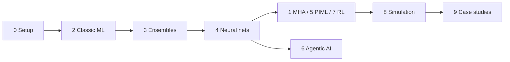
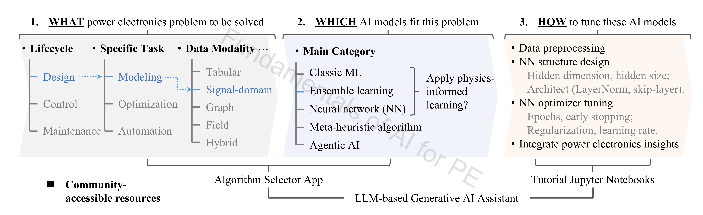

# Fundamentals of AI for PE — repository overview

<!-- traffic:start -->
<p align="center">
  <a href="https://github.com/XinzeLee/Fundamentals_of_AI_for_PE/graphs/traffic">
    
  </a>
  <a href="https://github.com/XinzeLee/Fundamentals_of_AI_for_PE/graphs/traffic">
    
  </a>
  <a href="https://github.com/XinzeLee/Fundamentals_of_AI_for_PE/graphs/traffic">
    
  </a>
</p>

<p align="center"><sub>Github traffic (monitoring started on May, 23, 2026) · cumulative tracked totals · Till 2026-09-28 UTC</sub></p>
<!-- traffic:end -->

## Support & citation

If this repo helps you, please give it a Star ⭐. Citation:

```
X. Li, F. Lin, J. J. Rodríguez-Andina, S. Vazquez, H. A. Mantooth, and L. García Franquelo,
"Fundamentals of Artificial Intelligence for Power Electronics," IEEE Trans. Ind. Electron., 2026.
```

<p align="center">
  <a href="https://ieeexplore.ieee.org/document/11707256">
    
  </a>
  &nbsp;&nbsp;
  <a href="https://www.researchgate.net/publication/411564495_Fundamentals_of_Artificial_Intelligence_for_Power_Electronics">
    
  </a>
</p>

## Companion tools

**Algorithm Selector** — pick AI/ML methods for a PE task. **ChatGPT tutor** — Q&A and reports aligned with this material.

<p align="center">
  <a href="https://xinzelee.github.io/AI_for_PE_Algorithm_Selector/">
    
  </a>
  &nbsp;&nbsp;
  <a href="https://chatgpt.com/g/g-698618895c2481919e113c49bafe23ee-fundamentals-of-ai-for-pe">
    
  </a>
</p>

<p align="center">
  <sub>Selector source: <a href="https://github.com/XinzeLee/AI_for_PE_Algorithm_Selector">XinzeLee/AI_for_PE_Algorithm_Selector</a></sub>
</p>

---

Hands-on Jupyter notebooks for the IEEE TIE review *Fundamentals of Artificial Intelligence for Power Electronics*—classic ML, neural nets, PIML, metaheuristics, and PE case studies.

## Navigate this README

| | |
|--|--|
| [Quick start](#quick-start) | [Learning path](#learning-path) |
| [What–Which–How](#whatwhichhow-framework) | [Paper ↔ repo](#paper--repo) |
| [Education PDF](#companion-education-article-pilot-course) | [Overview](#overview) |
| [Algorithms & data](#reference-algorithms--data) | [Authorship](#authorship--status) · [License](#license) |

## Quick start

1. **Local:** clone → `python -m venv .venv` (or conda/mamba) → activate → `pip install -r requirements.txt` → run [`0_To_Get_Started/package_install.ipynb`](0_To_Get_Started/).
2. **Colab:** use the **Open in Colab** badge in a module README; the first cell clones the repo, installs dependencies, and `cd`s to the notebook folder.

[`8_PE_Simulation_Automation`](8_PE_Simulation_Automation/) needs local simulators (LTspice, PLECS, …)—not for Colab.

## Learning path

Folder IDs follow the paper, not a strict week order. Suggested route:


```mermaid
flowchart LR
  setup["0 Setup"] --> classic["2 Classic ML"]
  classic --> ensemble["3 Ensembles"]
  ensemble --> nn["4 Neural nets"]
  nn --> advanced["1 MHA / 5 PIML / 7 RL"]
  advanced --> sim["8 Simulation"]
  sim --> cases["9 Case studies"]
  nn --> agentic["6 Agentic AI"]
```

| Folder | # | Role |
|--------|--:|------|
| [`0_To_Get_Started`](0_To_Get_Started/) | 1 | Env check |
| [`2_Classic_ML`](2_Classic_ML/) | 3 | Classical ML, GP, BO (**III**) |
| [`3_Ensemble_Learning`](3_Ensemble_Learning/) | 1 | Trees / ensembles (**III-E**) |
| [`4_Neural_Network`](4_Neural_Network/) | 5 | NNs, modalities, practices (**II–III**) |
| [`1_MHA`](1_MHA/) | 5 | Metaheuristics (**V**) |
| [`5_PIML`](5_PIML/) | 3 | Physics-informed ML (**IV**) |
| [`7_Reinforcement_Learning`](7_Reinforcement_Learning/) | 2 | DQN / DDPG (**III-D**) |
| [`6_Agentic_AI`](6_Agentic_AI/) | — | PE-GPT docs (**VI**) |
| [`8_PE_Simulation_Automation`](8_PE_Simulation_Automation/) | 2 | LTspice / PLECS / Simulink (**III-A**) |
| [`9_Case_Studies_PE`](9_Case_Studies_PE/) | 9 | Buck, DAB, IGBT, magnetics (**VII**) — [overview](9_Case_Studies_PE/README.md) |

## What–Which–How framework

<p align="center">
  
</p>

<p align="center"><em>Figure 1. “What–Which–How” framework for AI in power electronics.</em></p>

1. **What** — define the PE problem.
2. **Which** — choose models (classic ML, ensembles, NNs, …).
3. **How** — implement and tune them in the notebooks (and via the [tools](#companion-tools) above).

## Paper ↔ repo

Companion to *Fundamentals of Artificial Intelligence for Power Electronics* (*IEEE Trans. Ind. Electron.*, 2026).

| Sec. | Topic |
|------|-------|
| **I** | Introduction |
| **II** | PE data modalities |
| **III** | ML for PE |
| **IV** | PIML for PE |
| **V** | Metaheuristic optimization |
| **VI** | Agentic AI / PE-GPT |
| **VII** | Lifecycle case studies |
| **VIII** | Outlook |

| Folder | Maps to |
|--------|---------|
| [`0_To_Get_Started`](0_To_Get_Started/) | Setup (supports III–VII) |
| [`1_MHA`](1_MHA/) | **V** (V-A–C) |
| [`2_Classic_ML`](2_Classic_ML/) | **III-B – III-E** |
| [`3_Ensemble_Learning`](3_Ensemble_Learning/) | **III-E** |
| [`4_Neural_Network`](4_Neural_Network/) | **II**, **III-F – III-G** |
| [`5_PIML`](5_PIML/) | **IV** |
| [`6_Agentic_AI`](6_Agentic_AI/) | **VI** |
| [`7_Reinforcement_Learning`](7_Reinforcement_Learning/) | **III-D** |
| [`8_PE_Simulation_Automation`](8_PE_Simulation_Automation/) | **III-A** |
| [`9_Case_Studies_PE`](9_Case_Studies_PE/) | **VII** |

## Companion education article (pilot course)

[Reforming Power Electronics Education in the Era of AI](docs/Reforming%20Power%20Electronics%20Education%20in%20the%20Era%20of%20AI.pdf) (Xinze Li, H. Alan Mantooth) — makes the case for **domain-grounded** AI-for-PE teaching; this repo and the [companion tools](#companion-tools) are part of that toolkit.

## Overview

| Metric | Value |
|---|---:|
| Notebook code lines | **11,950** |
| Jupyter notebooks | **31** |
| PE dataset families | **7** |
| Algorithm labels | **25** |

## Reference: algorithms & data

### Algorithms

- **Optimization:** GA, PSO, NSGA-II
- **Neural:** FNN/MLP, CNN, RNN, GRU, LSTM, Transformer/Attention, MDN, PINN
- **Classical / ensemble:** Decision Trees, Random Forests, Ridge, SVR, PCA, t-SNE, Isolation Forest, One-Class SVM, XGBoost, GP regression

<details>
<summary><strong>Full label list (25)</strong></summary>

- `CNN (PyTorch)`
- `FNN/MLP (PyTorch)`
- `GRU (PyTorch)`
- `Genetic Algorithm (GA)`
- `LSTM (PyTorch)`
- `Mixture Density Network (MDN)`
- `NSGA-II (multi-objective GA)`
- `PINN (Physics-Informed Neural Network)`
- `PSO (Particle Swarm Optimization)`
- `RNN (PyTorch)`
- `Transformer/Attention`
- `Transformer/Attention (PyTorch)`
- `XGBoost (classification)`
- `XGBoost (regression)`
- `sklearn:GaussianProcessRegressor`
- `sklearn:DecisionTreeClassifier`
- `sklearn:IsolationForest`
- `sklearn:LinearRegression`
- `sklearn:OneClassSVM`
- `sklearn:PCA`
- `sklearn:RandomForestClassifier`
- `sklearn:RandomForestRegressor`
- `sklearn:Ridge`
- `sklearn:SVR`
- `sklearn:TSNE`

</details>

### Data

**PE datasets (D1–D7)**

| ID | Family | Modality | Source | Notebooks |
|----|--------|----------|--------|-----------|
| **D1** | Sync. buck performance | Tabular | [`Buck_Design/`](9_Case_Studies_PE/Buck_Design/) | `buck_modeling_NN`, `xgboost_buck_modeling`, `buck_comprehensive_case_study` |
| **D2** | DAB modulation table | Tabular | [`Performance_Modeling_and_Design/`](9_Case_Studies_PE/DAB_Design/Performance_Modeling_and_Design/) | `one_stop_AI_DAB_modulation` |
| **D3** | DAB adaptive modulation | Tabular | [`Adaptive_Modulation/`](9_Case_Studies_PE/DAB_Design/Adaptive_Modulation/) | `TinyML` |
| **D4** | DAB waveforms | Signal | [`Time_Domain_Modeling/Waveform/`](9_Case_Studies_PE/DAB_Design/Time_Domain_Modeling/Waveform/) | `time_series_modeling`, `rnn_basics` |
| **D5** | IGBT aging (RUL) | Signal / windows | [`IGBT_Maintenance/`](9_Case_Studies_PE/IGBT_Maintenance/); [NASA](https://data.nasa.gov/dataset/insulated-gate-bipolar-transistor-igbt-accelerated-aging) | `rul_prediction` |
| **D6** | Magnetic core loss | Tabular + harmonics | [`Magnetic_Modeling/`](9_Case_Studies_PE/Magnetic_Modeling/); [MagNet](https://www.princeton.edu/~minjie/magnet.html) | `magnet_fnn`, `magnet_lstm` |
| **D7** | 3-D thermal field | Field | [`Field_Data/cap_Tfield/`](4_Neural_Network/Field_Data/cap_Tfield/) | `field_temperature_residual_fnn` |

**Also used:** sklearn built-ins (`iris`, `breast_cancer`, `california_housing`, `make_*`) and in-notebook synthetics (Sphere/Rastrigin/ZDT, analytical buck surfaces, PINN demos, RL rollouts, MDN/hysteresis). Licensing: see [9_Case_Studies_PE](9_Case_Studies_PE/README.md) and per-track READMEs.

## Authorship & status

- **Code / course:** Xinze Li
- **Review article:** Xinze Li, Fanfan Lin, Juan J. Rodríguez-Andina, Sergio Vazquez, Homer Alan Mantooth, Leopoldo García Franquelo (*IEEE TIE*, 2026)—cite as above.

*Materials are under active refinement.*

## License

- **Code:** Apache 2.0
- **Educational content** (text, figures, explanations): CC BY-NC 4.0

Please cite the TIE paper when using the code. Educational use only; commercial use needs permission. See `LICENSE` and `NOTICE`.
